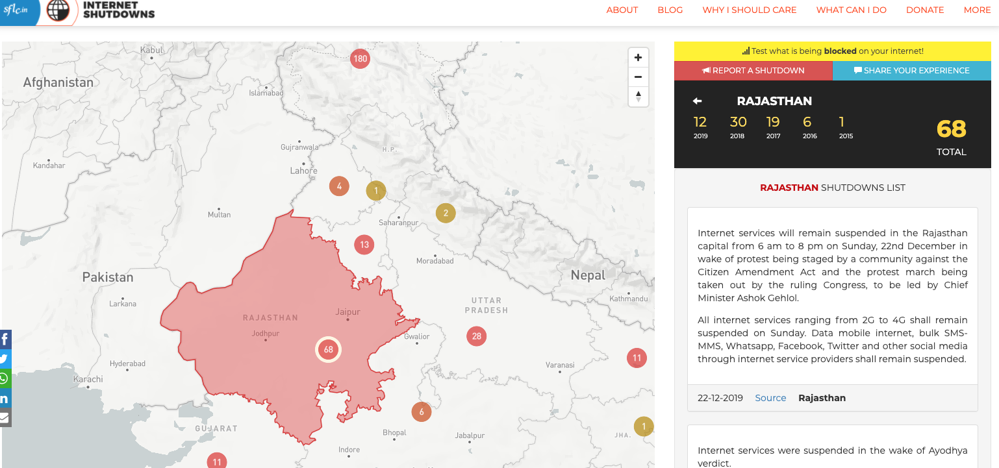

## "The Net Interprets Censorship as Damage" {.center}

> "The Net interprets censorship as damage and routes around it."
> — John Gilmore, quoted in *Time*, **December 6, 1993**

A founding myth of the open Internet. The rest of this course asks: **was it ever
true, and is it true now?**

::: {.notes}
Open on the 1993 quote. Ask the room: what's the context — commercial walled gardens
(Prodigy, AOL, CompuServe) dismantling walls to join the public Internet. Do you still
believe it? What's the biggest threat to it today? This sets up the whole arc: the
Internet went from walled gardens → open Net → re-centralized platforms. See
censorship-book Ch. 1.
:::

## What This Course Is About

We study how governments, platforms, and private actors **shape and curtail what
people can publish, access, and see** online — and how people push back.

- The **mechanisms**: technical, platform-based, legal, and economic
- The **measurement**: how we detect and quantify control
- The **circumvention**: how users route around it

::: {.notes}
This is an electives course built around the companion book. Research/reading/discussion
heavy, with a technical spine and a final project. Point them at the syllabus.
:::

## From "Censorship" to "Information Control" {.smaller}

The book's central reframing (Ch. 1): conventional **censorship** — outright blocking —
is only the crudest form. The real phenomenon is broader:

::: {.vignette}
**Internet information control is any attempt to control or curtail the publication of,
access to, or visibility of information online — any *tax* on access to information.**
:::

- Not just a **ban or block** — also **friction** (slowing, burying) and **flooding**
  (drowning out)
- A **sociotechnical** phenomenon: code *and* law *and* economics *and* norms

::: {.notes}
This is the thesis of the course. Most modern control isn't a firewall that says
"BLOCKED" — it's a tax: make the content slower, harder to find, or buried under noise.
Plausible deniability for the censor. See §1 framing in the book. We'll keep returning
to "tax on access."
:::

## Why Control Information?

::: {.columns}
::: {.column width="50%"}
- **Political** — stability, preventing collective action, shaping outcomes
- **National security** — real or claimed
:::
::: {.column width="50%"}
- **Religious / moral / social** — offense, "values"
- **Economic** — trade, productivity, protecting incumbents
:::
:::

The same technical mechanism serves very different motives — which is why we study
**means** and **motives** separately.

::: {.notes}
Book §1.1 "The Reasons for Information Control." The point: a throttle is a throttle
whether the motive is an election or a moral panic. Separating mechanism from motive is
an analytical move we use all term.
:::

## Roberts's Taxonomy: Fear, Friction, Flooding

- **Fear** — make people afraid to publish or view (arrests, surveillance, intimidation)
- **Friction** — make content *harder* to reach (throttling, blocking, buried results)
- **Flooding** — *dilute* the discourse with distraction, propaganda, and noise

Modern control leans on **friction and flooding** — quieter, deniable, and effective
for the majority.

::: {.notes}
Margaret Roberts (*Censored*, 2018) is the spine of how we'll talk about modern control.
Fear is the old model; friction and flooding are the modern, porous model. "Porous"
censorship is effective *because* it has holes — direct repression causes backlash;
inconveniencing most people is enough.
:::

## Shared Vocabulary (We Reuse This All Term) {.smaller}

| Term | Working definition |
|---|---|
| **Censor** | Any actor — state, platform, ISP, private party — that controls information |
| **Point of control** | A place on the path (ISP, transit, CDN, CA, platform, endpoint) where a censor can act |
| **Tax on access** | Any cost — block, delay, burial, noise — imposed on reaching information |
| **Porous** | Control that has holes by design; works on the majority, not the motivated few |
| **Fear / Friction / Flooding** | Roberts's three levers: scare, slow, or drown out |

These terms recur in every deck — pin them now.

::: {.notes}
This is the reusable reference slide — the same vocabulary anchors Ch. 2–6. Cold-call:
give me a point of control between you and a blocked site. Note that "censor" is
deliberately broad (not just the state) — a CDN or a payment processor is a censor in
our usage. "Porous" is the key word for the central puzzle slide later. See
censorship-book §1.1–1.2.
:::

## Historical Anchor: The Great Firewall of China {.smaller}

Since the late 1990s: Internet-scale packet filtering + DNS injection + TCP resets. The archetype of state-run censorship.

- **Traditional GFW:** keyword lists, DNS poisoning, IP blackholes, RST injection
- **Modern GFW (2024–2026):** machine-learning classifiers targeting **QUIC**, **DoH**, and **TLS Encrypted Client Hello** — pushing traffic back to censor-visible flows
- **Jan 1, 2026:** new PRC public-security law expands police powers over private messaging

::: {.notes}
Anchor the "conventional censorship" model here — this is what students think of when they hear the word. Then note the twist: GFW has moved *up the stack* to attack the modern anti-censorship protocols themselves. Book §1 refresh and §2.2.2. Iran and North Korea have similar (cruder) architectures; China's is the reference.
:::

## Democracies Do This Too {.smaller}

Same mechanisms, different justifications.

- **Egypt, Jan 2011:** BGP withdrawals disconnect ~88% of Egyptian networks during the Arab Spring
- **BART San Francisco, Aug 2011:** cell service cut in four downtown stations to disrupt planned protests
- **Turkey, 2014→:** repeated DNS blocking of Twitter, Wikipedia, YouTube — protesters spray-painted `8.8.8.8` on walls
- **India, 2025:** **65 shutdowns** — more than any other democracy (Access Now KeepItOn)

**Freedom House 2025:** roughly **two-thirds** of the world's Internet users live in countries rated "Partly Free" or "Not Free."

::: {.notes}
This is the "not just authoritarians" beat. Egypt is the canonical technical example; BART is the domestic one that shocks students. Turkey is the retail-scale ISP-DNS story. Then land the FOTN 2025 headline number — this is fresh. Book §1 refresh.
:::

## Case Study: The 2026 Age-Verification Wave {.smaller}

Liberal democracies, using **regulatory and financial** levers, not firewalls:

- **UK Online Safety Act:** ICO fines **Reddit £14.47M** for relying on self-declared age (2026). Ofcom fines against 4chan, AVS Group, Kick.com for missing age-assurance.
- **EU Digital Services Act:** common age-verification wallet declared "technically ready" (Apr 2026).
- **Australia:** world's first nationwide **under-16 social-media ban** (Dec 10, 2025). Platforms fined up to A\$50M. **4.7M under-16 accounts removed** in the first weeks.

Compliance itself becomes a **tax on speech** — you can't publish, or be published, unless you can prove your age.

::: {.notes}
Today's breakout A anchor. Present the tension: child protection or a speech tax? Both, per Chapter 1. Ofcom fine amounts and Australia numbers are verified. Book §1 refresh.
:::

## Case Study: Consolidation as Chokepoint {.smaller}

**November 18, 2025 — Cloudflare outage.** A routine database permissions change ballooned a bot-management config file. Result:

- **X**, **ChatGPT**, **Shopify**, **Truth Social**, **NJ Transit** — inaccessible for hours
- Not an attack. Not a takedown demand. Just one company's internal misconfiguration
- Cloudflare CEO in 2017: *"I woke up in a bad mood and decided someone shouldn't be allowed on the Internet. No one should have that power."* — 8 years later, that power has **grown**.

::: {.notes}
Today's breakout B anchor. The state-run firewall is not the only way large amounts of speech go dark. In 2025 the chokepoint is a handful of infrastructure companies — Cloudflare handles ~20% of web traffic. Book §1 refresh + §2.3.
:::

## Economic Levers: Paywalls, Demonetization, Zero-Rating {.smaller}

::: {.columns}
::: {.column width="50%"}
**Paywalls (Pew, 2024):**

- **74%** of Americans hit paywalls
- Only **1%** pay
- 30% of top-income pay; **8%** of lowest
:::
::: {.column width="50%"}
**Demonetization (YouTube "Adpocalypse"):**

- 2017: advertisers flee sensitive content
- LGBTQ+, war reporting, current events → demonetized
- Creators self-censor to stay solvent
:::
:::

**Zero-rating** (Facebook Free Basics et al.) — free access to *some* content shapes the whole information diet in 100+ countries.

::: {.notes}
Book §1 and §4.4–4.5. The economic lever is often the strongest — pricing does the work of blocking. Paywalls stat is one of the most quotable numbers in the book; use it.
:::

## The Many Forms of Control (the Course Roadmap) {.smaller}

The book's §1.2 forms are the chapters — and our lectures:

| Form | What it controls | Book |
|---|---|---|
| **Technical controls** | protocols, routing, the flow of data | Ch. 2 |
| **Platform controls** | feeds, ranking, moderation, propaganda | Ch. 3 |
| **Legal & economic controls** | law, copyright, net neutrality, money | Ch. 4 |
| **Measuring** information controls | how we *know* | Ch. 5 |
| **Taking back control** | VPNs, Tor, circumvention | Ch. 6 |

::: {.notes}
This slide is the map of the whole course, and it's literally the book's table of
contents. Each later deck is one row. Tell them where we're going so the individual
lectures have a home.
:::

## How Control Is Implemented (Technical) {.smaller}

::: {.columns}
::: {.column width="50%"}
**Protocol interference**

- IP filtering
- **DNS** manipulation / poisoning
- TCP connection resets
- HTTP(S) redirection / SNI filtering
:::
::: {.column width="50%"}
**Infrastructure & platform**

- DNS registries / registrars
- Certificate authorities, CDNs
- Social media, search engines
:::
:::

Points of control sit all along the path — **access ISPs, transit, CDNs, platforms,
and the endpoint itself**.

::: {.notes}
A preview of Ch. 2–3. Don't go deep here — just establish that there are many points of
control between Alice and Bob, and the censor can act at any of them. We'll spend weeks
on these.
:::

## Non-Technical Control Is Just as Real

- **Self-censorship** — fear of backlash; pervasive and nearly undocumented
- **Law & policy** — copyright takedowns (DMCA §512); **intermediary liability**
  (US **CDA §230** and its global counterparts, EU **DSA**) — *we take this up in
  Ch. 4 / the Legal deck*
- **Economic** — demonetization, payment cutoffs, infrastructure deplatforming

::: {.notes}
Book §1.2 and Ch. 4. The legal/economic lever is often *more* powerful than the
technical one — a payment processor or a CA can deplatform faster than a firewall.
This is the explicit forward-pointer to the Legal chapter: §230 is the rule that
platforms are *not* liable for user content (and may moderate in good faith). It's
under heavy pressure in 2025–26 — the Supreme Court has repeatedly declined to revisit
it (Oct 2025), but state courts are narrowing it via product-design theories (a Calif.
jury found platforms liable for addictive teen-harm design, March 24 2026; Mass. SJC
let a similar Meta claim proceed, April 10 2026). The EU DSA is the contrasting
must-act-on-notice regime. We do all of this in the Legal deck — don't litigate it now.
:::

## How Widespread Is It? {.center}

Censorship and information control are not a fringe phenomenon — they are practiced in
**dozens of countries**, including electoral democracies, and increasingly run on
**centralized infrastructure**.

::: {.notes}
Transition slide into the live data. The old slide said ">60 countries / Freedom on the
Net." We refresh that with current shutdown data on the next slide rather than citing a
stale number.
:::

## A 2026 Vignette: Shutdowns Keep Climbing {.smaller}

::: {.vignette}
Access Now's **KeepItOn** coalition documented **313 internet shutdowns across 52
countries in 2025** — the highest annual count it has recorded — with **conflict** the
leading trigger for the third year running, and **70 shutdowns coinciding with grave
human-rights abuses** in 21 countries. *(Report released March 31, 2026.)*
:::

Shutdowns are the **bluntest** instrument — and they're rising. Most control is subtler.

::: {.notes}
This is the freshest, verified hook — swap it each year (see coverage-notes). The
teaching point: even as control gets subtle (friction/flooding), the crudest tool —
the full shutdown — is at an all-time high, concentrated in conflict and elections.
Tools that track this: internetshutdowns.in, OONI, Censored Planet. Source: Access Now
KeepItOn 2025 annual report.
:::

## The "Globalization" of Censorship {.smaller}

Control is no longer an authoritarian niche — the **infrastructure and the playbook
travel** (book §1.3):

- **China's model as export** — Freedom House (*Freedom on the Net 2025*) reports **at
  least 80 countries** have adopted Chinese surveillance/filtering technology; global
  Internet freedom has declined for the **15th straight year**
- **Centralized filtering scales** — once a country has chokepoints, blocking and
  shutdowns become technically trivial to replay
- **Democracies adopt the tools too** — legal pressure, infrastructure
  **consolidation** (a few CDNs, CAs, app stores), and private moderation

::: {.vignette}
The same mechanisms that let **Egypt** flip off the Internet in 2011 are now *ubiquitous*
— centralized control means a shutdown is technically feasible almost anywhere.
:::

::: {.notes}
Book §1.3 ("The Globalization of Internet Censorship"). Key move: separate the *technology*
from the *regime*. The Great Firewall was the prototype; the prototype is now a product
line — Freedom House's "80 countries" figure (Freedom on the Net 2025) is the verified
hook. Tie back to consolidation (Cloudflare/Dyn): centralization is what makes the
export effective and what makes Western shutdowns feasible. Don't moralize — the point is
mechanism diffusion. See coverage-notes for the source.
:::

## We Can Measure It

Crowdsourced and infrastructure measurement — **OONI**, **Censored Planet**, **Google
Transparency Report**, shutdown trackers — turn anecdotes into evidence.

::: {.notes}
Preview of Ch. 5 (Measurement). The whole field exists because control is often designed
to look like ordinary failure — measurement is how we tell censorship from a bad day on
the network. We'll do hands-on OONI and RouteViews later.
:::

## The Trend: From Protocols to Platforms

- Early censorship: **block the protocol** (IP/DNS/keyword filtering)
- Modern control: **shape the platform** — ranking, recommendation, moderation,
  **personalization** ("filter bubbles"), and **information operations** (sock-puppets,
  astroturfing, disinformation)
- Underneath both: **centralization** of infrastructure raises takedown risk

::: {.notes}
The arc of the course and the book: control moved up the stack from pipes to platforms.
Centralization (a few CDNs, CAs, app stores, social platforms) is what makes modern
takedown both easy and deniable. Zuckerberg's "squirrel dying in front of your house"
line is the filter-bubble hook if you want it.
:::

## Why Bother, If It's Circumventable?

Most control is **porous** — VPNs, Tor, homophones, decoy routing all defeat it. So why
do states invest in it?

- Because **friction works on the majority** — small costs shift most behavior
- Because it offers **plausible deniability** — "just a network problem"
- **Direct repression backfires;** quiet friction does not

::: {.notes}
The course's central puzzle, stated plainly. Resolve it with the "tax" framing: you
don't need a perfect wall, just a toll most people won't pay. The motivated few get
through (Ch. 6, circumvention) — and that's often acceptable to the censor.
:::

## Course Logistics {.smaller}

- **The book is the spine** — each lecture maps to a chapter; reading is posted ahead
- **Before class:** submit reading-response questions; we work through them together
- **Assessment:** participation & discussion, in-class activities, and a **research
  project** (proposal → interim → final)
- **All assignment release and due dates are on the schedule from day one** — and we
  stick to them
- **Questions:** post in the **public channel** (fastest; peers help too) — DMs have no
  response-time guarantee. Office hours by appointment.

::: {.notes}
These logistics bullets directly answer last year's feedback: concrete published
deadlines, clearer expectations, and a communication-channel policy. Point them at the
syllabus' Communication & Response Times section and the schedule.
:::

# Let's Get Started {.center}

Next: **Technical Controls** — why are Internet protocols so easy to manipulate?
*(censorship-book Ch. 2)*
