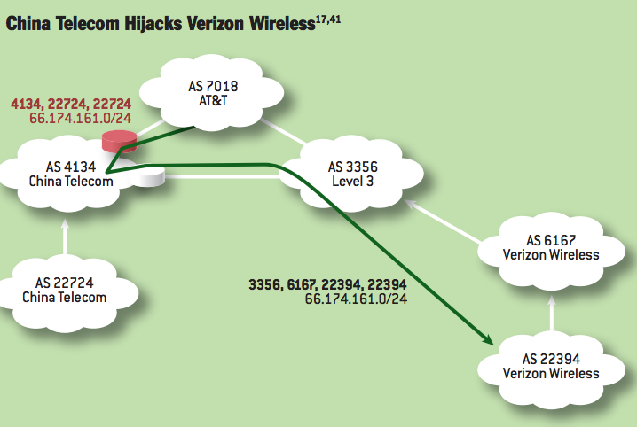
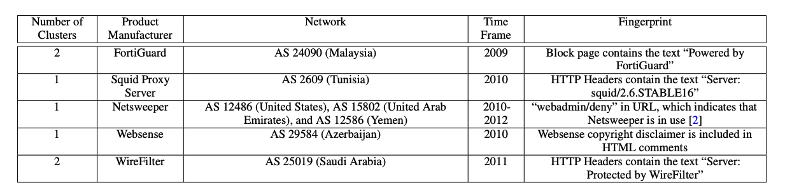

## Why Are the Internet's Protocols So Easy to Manipulate? {.center}

The Internet was designed in the 1970s–80s as a **research network among
trusted parties** who all knew one another. Security was an afterthought.

That legacy is the **root cause** of most technical censorship today.

::: {.notes}
This is the thesis of Ch. 2, §2.1. The Internet was nominally designed to survive a
nuclear attack — so why is it so brittle? Because the original designers optimized for
interconnecting trusted networks, not for an adversarial environment. Confidentiality,
integrity, and availability were all retrofits. Morris worm (1988) was the first wake-up
call. We keep returning to: "the network looks broken" and "the network is being
censored" often look identical. See censorship-book Ch. 2, §2.1.
:::

## A "Protocol" Is Just an Agreement

A **protocol** is the set of rules that lets two devices exchange information —
the *language* of the Internet.

- **Open** and **simple** by design — anyone can build something that speaks it
- That openness drove the Internet's success
- It also made the protocols **trivial to manipulate** — routers and resolvers
  believe whatever they are told

::: {.notes}
Keep this concrete: IP is the "narrow waist" — every device speaks it, over any medium
(fiber, cellular, even carrier pigeon). The same property that lets any device join also
lets any device lie. No built-in accountability, no authentication. That is the lever
every technique in this deck pulls.
:::

## Manipulation Targets a Few Points in the Stack {.smaller}

The book organizes technical control by **which protocol layer** is attacked:

| Layer | Protocol | Characteristic attack |
|---|---|---|
| **Naming** | DNS | Return the *wrong answer* |
| **Transport** | TCP/IP | *Reset* or block the connection |
| **Routing** | BGP | *Hijack* or withdraw the route |
| **Applications** | HTTP(S) | *Block pages*, SNI filtering |

Plus a cross-cutting tool: **throttling** — degrade rather than block.

::: {.notes}
This table is the roadmap for the whole deck (book Table 2.1). Each row is one section.
Emphasize: these are *different points of control*, with different precision, scope,
visibility, and circumvention difficulty. We'll close with a comparison table on exactly
those axes.
:::

# Naming: The Domain Name System {.center}

*Return the wrong answer.*

## DNS Maps Names to Addresses

::: {.notes}
Walk the hierarchy: stub resolver → local recursive resolver → root → .edu → uchicago →
cs. Each authoritative server hands back a *referral* to the next. The client typically
calls `getaddrinfo()` and never sees any of this. The local resolver is usually assigned
automatically via DHCP when you join the network — most people never think about it. See
§2.2 (Naming).
:::

## DNS Is Insecure by Default

DNS historically has **no integrity and no confidentiality** protections.

- The client has **no way to verify** the IP address it gets back
- Manipulating it is trivial: a resolver simply **returns a different answer**
- Manipulation can happen at **any level** of the hierarchy — local resolver
  *or* a poisoned root referral

::: {.notes}
Origin story: DNS manipulation started as *monetization* — resolvers redirected typos
("gogle.com") to ad pages instead of returning NXDOMAIN. Censors realized the same
trick works for blocking. Observed on-path in Iran (May 2013). Researchers have also
caught fake root-server referrals — answers arriving from inside China *faster* than the
speed of light would allow from the real root server in LA. That timing anomaly is the
tell.
:::

## DNS Censorship in the Wild: Turkey, 2014

In **March 2014**, Turkish ISPs redirected users trying to reach **Twitter** to
government servers. Citizens spray-painted **`8.8.8.8`** — Google's public
resolver — on walls as a workaround.

- DNS manipulation is **easy to deploy** *and* **easy to evade** (just switch
  resolvers)
- That porousness is exactly why it's the **first** layer censors reach for

::: {.notes}
The "8.8.8.8 on the walls of Istanbul" image is the canonical DNS-censorship story
(book §2.2). It captures the cat-and-mouse: trivial to deploy, trivial to route around —
*if* you know how. Most users don't, which is enough for the censor. Set up the
centralization tension next: switching to 8.8.8.8 only helps if Google isn't the one
being compelled.
:::

## Detecting DNS Manipulation Is Hard {.smaller}

You can't just compare IP addresses across the world — **CDNs legitimately
return different answers** by location.

Real detection looks for inconsistency across **multiple dimensions**:

- **Origin AS / organization** hosting the address
- **HTTP content** returned by the address
- **Reverse DNS** → which CDN
- **TLS certificate / SNI** validity for the domain

A resolver might localize an answer — but rarely is it inconsistent across *all*
of these at once.

::: {.notes}
This is the measurement craft (preview of Ch. 5). The key subtlety: a censor can disguise
manipulation as "just a CDN giving you a regional server." You defeat that by triangulating
across AS, content, rDNS, and certificate. One bad signal is noise; all of them
disagreeing is censorship. This is the IRIS / Censored Planet methodology.
:::

## Encrypted DNS Helps — and Centralizes {.smaller}

::: {.columns}
::: {.column width="50%"}
**DNS over HTTPS (DoH)**

- Encrypts queries inside HTTPS (port 443)
- Hides them from on-path ISPs
- Chrome → Google `8.8.8.8`,
  Firefox → Cloudflare `1.1.1.1`
:::
::: {.column width="50%"}
**The catch**

- You still **trust the resolver** — it can lie
- Resolution is **consolidating** into a handful of providers
- One court order to **one** company censors **millions**
:::
:::

**DNSSEC** signs records cryptographically; **ODoH** splits *who* is asking from
*what* is asked. Both are unevenly deployed.

::: {.notes}
The big modern point (book §2.2): DoH solves on-path manipulation but creates a *trust*
and *centralization* problem. Old model: compel thousands of ISP resolvers. New model:
compel Google or Cloudflare once. Germany 2023 — copyright holders tried to force
Cloudflare to block sites at the DNS layer; the court refused on overblocking grounds,
but that fight is the future. DNSSEC = integrity; DoH = confidentiality; they're
complementary, not the same thing.
:::

# Transport: TCP/IP {.center}

*Reset or block the connection.*

## TCP in One Slide

- **IP addresses** locate endpoints (IPv4 = 32 bits, ~4 billion — not enough)
- A connection starts with a **three-way handshake**: `SYN` → `SYN-ACK` → `ACK`
- Data flows in numbered packets; a **`RST` packet** tears the connection down

The censor's lever: **TCP has no authentication** — anyone on the path can
forge a packet.

::: {.notes}
Just enough TCP to make the attack legible (book §2.2 Transport). The two facts that
matter: (1) a RST from either side kills the connection, and (2) sequence numbers order
the stream. Both are forgeable by an on-path device because nothing is signed. Don't go
deeper than this — they get the full version in a networking course.
:::

## TCP Reset Injection

An **on-path firewall** inspects traffic, spots forbidden content, and injects a
forged **`RST`** — the connection drops with a generic error.

- Works in **either direction**; based on **content** or **endpoints**
- China's **Great Firewall** is the canonical user (Clayton et al., 2007)
- Early circumvention: **just ignore the RST packets**

A related trick: inject a **duplicate sequence number** ahead of the real data,
so the host discards the legitimate packet.

::: {.notes}
The GFW is fundamentally an on-path injector, not an in-path blocker — it races the real
server with a forged reset. That's why ignoring RSTs worked early on (both ends had to
honor it). Mention the firewall as a *topological chokepoint*: censorship at scale needs
a cut in the graph separating "censored" from "uncensored." Snort, iptables, Blue Coat
are the tooling.
:::

## Defending TCP/IP: Encryption Moves the Battle {.smaller}

- **TLS** encrypts the payload — the censor can't read or alter content
- **VPNs / Tor / Shadowsocks** hide the endpoints and traffic patterns
- But **metadata leaks**: IP addresses, packet timing, and (until ECH) the
  **SNI** still reveal *where* you're going

None are foolproof — **deep packet inspection (DPI)** identifies and disrupts
even encrypted flows. It's a permanent **cat-and-mouse game**.

::: {.notes}
Bridge slide to circumvention (Ch. 6). Encryption raised the censor's cost but didn't end
the game — it pushed them from *content* inspection to *metadata* and *fingerprinting*.
SNI is the cliffhanger: TLS encrypts everything except the server name in the handshake,
which censors read to block by domain. ECH (Encrypted Client Hello) closes that, which is
why some states now block ECH outright.
:::

# Routing: The Border Gateway Protocol {.center}

*Hijack or withdraw the route.*

## BGP: Driving Directions, One Hop at a Time {.smaller}

The Internet is **90,000+ independent networks** (autonomous systems). **BGP**
is how they tell each other how to reach destinations.

- Not turn-by-turn like Google Maps — more like *"I can get you to the state
  line; ask the next network from there."*
- Each AS advertises **prefixes** it can reach and an **AS path**
- **No security:** a router believes **any** route a neighbor advertises

::: {.notes}
The driving-directions analogy is the book's (§2.2 Routing). DNS is the address book, TCP
is the roads, BGP is the directions — handed out hop by hop, each "border gateway"
forwarding one step closer. The fatal flaw: zero authentication. Transitive trust. A
router accepts whatever its neighbor says, and propagates it. That's the whole
vulnerability.
:::

## Route Hijacking: China Telecom, 2010

On **April 8, 2010**, China Telecom advertised **~50,000 prefixes** from 170
countries for **~18 minutes** — re-routing traffic through China.

::: {.notes}
Why did most people *not* notice? (Cold-call this.) Two reasons from the book: (1) China
Telecom announced the *same* prefix length, so routers preferred the *shorter AS path* —
many kept the legit route; (2) traffic still ultimately reached the destination, just via
a surveillable detour. The scary part isn't the outage — it's that a huge slice of US
traffic silently transited China for 18 minutes. The diagram shows the split: AT&T takes
the hijacked path, Level 3 doesn't.
:::

## Hijacks Cut Both Ways: Pakistan & YouTube {.smaller}

**February 24, 2008:** Pakistan Telecom tried to block YouTube *domestically* by
advertising a **more-specific /24** of YouTube's /22.

- The bogus route **leaked globally** — **longest-prefix match** meant everyone
  preferred it
- Within minutes, **two-thirds of the Internet** sent YouTube traffic to Pakistan
- YouTube fought back by advertising **two /25s** — even more specific — to win
  the traffic back

::: {.notes}
This is the cautionary tale (book §2.2). Intent was domestic censorship; result was a
global YouTube outage, because BGP doesn't respect borders. Longest-prefix-match is the
mechanism: a /24 always beats a /22, a /25 beats a /24. It's "an absolute hack" that
YouTube split its prefix to reclaim traffic. Lesson: BGP censorship is **coarse and
leaky** — hard to keep inside one country.
:::

## BGP as a Kill Switch — and Its Defenses {.smaller}

- **Withdraw** routes and a network simply **disappears**. Egypt, **Jan 2011**:
  ~3,500 routes pulled, **~88% of Egyptian networks** off the global Internet.
- BGP is **all-or-nothing** and **coarse** (whole prefixes), with **high
  collateral-damage risk** — reserved for total blockades.

**Defenses:** **RPKI** + route-origin validation (sign your prefixes),
**monitoring** for anomalous paths, **MANRS** norms — all need *wide* adoption
to help.

::: {.notes}
Egypt 2011 is the archetypal shutdown-by-routing — and a democracy-adjacent reminder that
this isn't only authoritarian states (BART cut cell service in SF the same year). Contrast
with DNS: you can switch resolvers to beat DNS censorship; if BGP withdraws your route,
there is *no route* — change ISPs or leave the country. RPKI is the main defense but
adoption is partial, so gaps remain. See §2.2.
:::

# Applications: Blocking Web Pages {.center}

*Block pages, redirection, SNI filtering.*

## Block Pages: Censorship You Can See {.smaller}

Unlike a silent reset, a **block page** *tells* the user they've been blocked.

- Conceptually simple, lots of commercial software: **FortiGuard, NetSweeper,
  Websense, Squid, WireFilter**
- Historically an easy **on-path** trick: see the request, reset it, inject your
  own HTTP response

::: {.notes}
Block pages are the *visible* end of the spectrum — great for studying because the censor
announces itself. The fingerprint table is real measurement data: each vendor leaves a
tell ("Powered by FortiGuard", a Squid header, a Websense copyright comment). Detection
trick from the book: block pages are usually *much shorter* than the real page — a
length comparison works, no ML needed. Mechanisms also drift over time and by ISP
(Thailand changed vendors).
:::

## Encryption Is Eroding On-Path Filtering

- **HTTPS** hides the URL and content — on-path block-page injection breaks
- Censors fall back to coarser tools: **IP blocks**, **SNI-based filtering**,
  **throttling**
- **TLS 1.3 + ECH** (Encrypted Client Hello) hides even the **SNI** — so some
  states now **block ECH itself**

The trend: control moves from **content** → **metadata** → **platforms**.

::: {.notes}
This is the arc of the whole course in one slide (book §2 takeaways). As encryption
closes each window, censors move to coarser, more collateral-prone tools — and
increasingly, *up the stack* to platforms (Ch. 3). SNI was the last cleartext field;
ECH closes it; blocking ECH is the current front line. Good place to foreshadow
circumvention (Ch. 6).
:::

# Throttling: Friction, Not a Wall {.center}

## Throttling Slows Instead of Blocks {.smaller}

**Throttling** degrades performance to a site rather than blocking it outright.

- A textbook case of Roberts's **friction** — raise the *cost* of access
- **Plausibly deniable:** nearly indistinguishable from congestion or a bad day
- Implemented with traffic shapers (token / leaky bucket); often keyed on **SNI**
- The hardest technique to **detect** reliably

::: {.vignette}
**Russia throttled YouTube, 2024–2025.** Starting **July 2024**, Russian
networks degraded YouTube by detecting the **`googlevideo.com` SNI** and dropping
packets — capping video to ~240p. By **January 2025**, YouTube had fallen to
**6–12% of Russian Internet traffic, down from ~43%** before throttling, without
a formal "block." *(Carnegie Endowment, Feb 2025; OONI/DFRLab technical analysis,
Jan 2025.)*
:::

::: {.notes}
This is the freshest verified hook — swap it each year (see coverage-notes). It's the
*perfect* friction example: no block page, no error, just "YouTube is slow lately."
Roskomnadzor never had to admit a block; usage collapsed anyway, and VPN demand spiked.
Note the SNI thread tying throttling back to the TLS discussion. Source: Carnegie
Endowment (Feb 2025) for the traffic-share figures; OONI/DFRLab for the SNI mechanism.
Verify a fresher Russia/Iran throttling case at refresh time.
:::

## Comparing the Techniques {.smaller}

| | **DNS** | **TCP/IP** | **BGP** | **Throttling** |
|---|---|---|---|---|
| **Ease** | Easy | Moderate | Hard | Moderate |
| **Precision** | Per-domain | Per-connection | Whole prefix | Per-flow |
| **Visibility** | Often fake page | Timeout/reset | Total loss | "Just slow" |
| **Collateral** | Low | Low–med | **High** | Med–high |
| **Circumvent** | Easy (DoH) | Moderate | Hard | Moderate |
| **Detect** | Easier | Moderate | Moderate | **Hardest** |

::: {.notes}
This is book Table 2.2 — the synthesis. The pattern: easier-to-deploy techniques (DNS) are
also easier to circumvent and detect; the heavy hammer (BGP) is hard to aim and risks
global collateral; throttling trades bluntness for *deniability*. There's no free lunch
for the censor — which is exactly why they mix techniques.
:::

## Takeaways {.smaller}

- The Internet's protocols trusted their peers; **security was an afterthought**,
  and that legacy enables most technical censorship
- **DNS** is the easiest to manipulate (return a wrong answer) and the first
  layer censors and encrypted-DNS defenses both target
- **BGP** hijacks are rarer but **consequential** — they can black-hole or
  reroute huge swaths of traffic, sometimes by accident
- **Encryption** is eroding on-path inspection, pushing censors toward **coarser
  tools, throttling, and platform-level controls** (Ch. 3)

*See censorship-book Ch. 2 Technical Controls, §2.1–2.2.*

::: {.notes}
Land the three book takeaways and point ahead. Next deck: disrupting *data* and encrypted
traffic in depth, then platform controls (Ch. 3). Reading: Ch. 2, §2.1–2.2. Hands-on this
unit: DNS / secure DNS, RouteViews for BGP, and throttling detection (see agenda
Lectures 2–4).
:::
