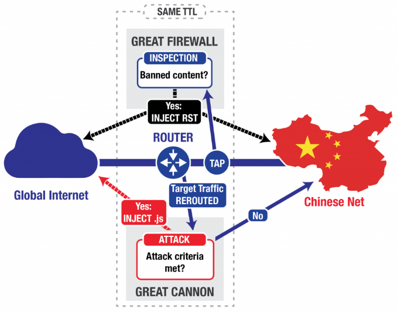
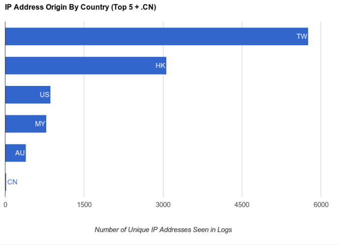

## A Tax on Access, Not a Wall {.center}

Most of this chapter has been about **blocking** — DNS poisoning, TCP resets,
BGP hijacks. This lecture is about a quieter lever: **degrading** the flow of
data instead of stopping it.

Make a service **slow** instead of **gone**, and most users give up — with no
"BLOCKED" page to screenshot.

::: {.notes}
Open by reconnecting to the course thesis: information control is a *tax on
access*, and Roberts's **friction** is the heart of this lecture. Blocking is
fear/visible; throttling and DoS are friction — they raise the cost of reaching
content without an obvious censorship event. The censor's advantage here is
*deniability*. See censorship-book Ch. 2, §2.3.
:::

## Two Ways to Degrade, Not Block

::: {.columns}
::: {.column width="50%"}
**Throttling**

- *You* slow the user's own traffic
- Selective, targeted, subtle
- Looks like "the network is slow"
:::
::: {.column width="50%"}
**Denial of Service (DoS)**

- *Flood* the service from outside
- Overwhelm a finite resource
- Looks like "the site is down"
:::
:::

Both **disrupt availability**. Neither leaves a clean fingerprint that says
*"a censor did this."*

::: {.notes}
Frame the whole lecture with this split. Throttling acts on the victim's own
pipe; DoS attacks the destination. The shared property — the reason both are
politically attractive — is that the user experiences a *failure mode*
("slow," "down"), not a *censorship event*. That ambiguity is the product.
:::

# Throttling and Rate Limiting {.center}

*Slowing access without ever saying no.*

## Throttling Is Friction by Design

**Throttling** (a.k.a. **rate limiting**) deliberately slows access to a site
or service.

- A **legitimate** network-management tool — keep one user/app from hogging
  shared capacity
- The *same* mechanism becomes **censorship** when aimed at a platform,
  service, or dissident
- Roberts's **friction**: raise the cost of reaching content until users quit

::: {.notes}
Stress the dual-use nature. Rate limiting is everywhere and benign — fairness
across users, protecting a server. What makes it censorship is *who* and *why*,
not the mechanism. This is exactly the means/motive separation from the Intro
deck. The censor's win condition: frustrate the majority into giving up.
:::

## How a Traffic Shaper Works

A **traffic shaper** sits on the path — typically inside an ISP's router or
switch — and does two things:

1. **Identify** which traffic to throttle (which app, which destination)
2. **Shape** how fast that traffic is allowed to flow

Identified traffic is sorted into **separate queues** (e.g., video in one, the
rest in another); the shaper controls how fast each queue drains.

::: {.notes}
This is the mental model for the rest of the throttling section. Two steps:
*classification* then *shaping*. Both are points of control. The hard part for
the censor is step 1 (identification) — which is also where circumvention
fights back, as we'll see. Book §2.3, "How traffic shapers work."
:::

## Identifying What to Throttle {.smaller}

The shaper must first **classify** traffic — and every method is an arms race
with encryption:

| Method | How it works | Weakness |
|---|---|---|
| **DNS-based** | watch lookups for `netflix.com`, throttle those IPs | shared cloud IPs → over-blocking |
| **SNI inspection** | read the hostname in the **plaintext TLS handshake** | **ECH / Encrypted ClientHello** hides it |
| **Deep packet inspection (DPI)** | match packet sizes, timing, signatures | costly; degrades as apps encrypt |

The **best defense against throttling is to break identification** — if the
censor can't tell what your traffic is, it can't single it out.

::: {.notes}
This table is the spine of the throttling section and the bridge to
circumvention (Ch. 6). Note the trajectory: as DNS, SNI, and payloads encrypt,
classification gets harder. **Encrypted ClientHello (ECH)** is the live front
in 2025–26. Circumvention targets the *identification* step, not the shaping —
once you're in the throttled queue, you have no say in how packets are
forwarded.
:::

## Shaping: Leaky Bucket vs. Token Bucket {.smaller}

::: {.columns}
::: {.column width="50%"}
**Leaky bucket**

- Drains at a **constant rate** ρ — "drip, drip, drip"
- Output **never** exceeds the drain rate
- Smooths bursts; full bucket → **drop packets**
:::
::: {.column width="50%"}
**Token bucket**

- Tokens refill at rate ρ, up to a cap β
- Spend a token to send → allows **controlled bursts**
- Average rate bounded by ρ; burst bounded by β
:::
:::

Both rely on **finite queues**. When a queue fills, packets are dropped — and
**TCP reads loss as congestion and slows down**, which is exactly what the
shaper wants.

::: {.notes}
Keep this conceptual, not mathematical. Key contrast: leaky bucket = strict
constant rate (no bursts); token bucket = bounded burstiness. The deep point:
the shaper doesn't have to "block" anything — it just *drops a few packets* and
lets TCP's own congestion control do the throttling. The mechanism weaponizes
the protocol's good behavior. (RED — Random Early Detection — drops
probabilistically before the queue is full to avoid global synchronization.)
:::

## Why Throttling Is So Hard to Catch

The censor's real advantage is **deniability**:

- Slowdowns happen all the time — **congestion, routing, peering disputes,
  wireless variability**
- A user just sees "slow," not "blocked" — and often **gives up without
  knowing why**
- Measurement tools (**Wehe**, Glasnost) replay traffic with/without a tunnel —
  but results are **noisy and often contradictory**

::: {.vignette}
**Throttling ≠ congestion.** Around 2014, U.S. subscribers blamed ISPs for
"throttling" **Netflix**. The real cause was mostly a **peering dispute** —
letting an interconnection link congest, not deploying a shaper. Same user
experience, very different mechanism. *(censorship-book §2.3; ties to net
neutrality, Ch. 4.)*
:::

::: {.notes}
This is the central epistemics problem of the lecture: you usually *can't
prove* throttling from the edge. Wehe (Northeastern) is the canonical tool —
replay a Netflix/YouTube trace in the clear and through an encrypted tunnel; if
the tunnel is faster, suspect selective throttling. But network noise means the
same test on the same ISP can disagree across users. The Netflix/peering case
is the must-teach nuance: "throttling" is overloaded — congestion at a peering
link looks identical to the user. Foreshadows net neutrality.
:::

## Throttling as a Live Political Tool {.smaller}

::: {.vignette}
In its **March 31, 2026** report, Access Now's **#KeepItOn** coalition
documented **313 internet shutdowns across 52 countries in 2025** — its
highest annual count (up from **296** in 2024) — and flagged a shift from **total blackouts to
"targeted" restrictions**: slowing or blocking single platforms like
**Telegram, WhatsApp, and TikTok** rather than cutting everything. **Turkey**
in particular leans on **throttling of social media** during unrest.
:::

The trend is *toward* friction: targeted, deniable degradation over the blunt,
visible kill switch.

::: {.notes}
Freshest verified hook — swap each year (see coverage-notes). Teaching point:
the macro-trend confirms the lecture's thesis. As full shutdowns draw
international condemnation, regimes move to *targeted* throttling/blocking of
specific apps — quieter, more deniable, still effective on the majority. Turkey,
Iran, and others throttle around protests and elections. Source: Access Now
KeepItOn 2025 annual report (released Mar 31, 2026).
:::

## Throttling at Home: A Private "Tax on Access" {.smaller}

Friction isn't only a state tool — **platforms** do it too.

::: {.vignette}
In **August 2023**, a *Washington Post* analysis found **X (Twitter)** was
adding a **~5-second delay** to outbound links to sites Elon Musk had publicly
feuded with — **The New York Times, Reuters, Bluesky, Threads, Substack,
Facebook, Instagram**. After the reporting, delays to the *Times* and *Reuters*
were quietly removed; others persisted.
:::

A few seconds of latency, applied selectively, is a **tax on reaching a
competitor or critic** — friction with no "block" anywhere.

::: {.notes}
Great non-state illustration of the same mechanism. A dominant platform can
throttle *outbound* traffic to disfavored destinations — competitors and
critical press — and call it nothing at all. No block page, no ban; just a toll
booth. Ties friction directly to platform power (Ch. 3) and shows that
"information control" is broader than governments.
:::

# Denial of Service {.center}

*Make it slow or gone by overwhelming it.*

## DoS: Exhaust a Finite Resource

A **denial-of-service** attack overwhelms some **finite resource** so
legitimate users can't get through:

- **Network** — saturate bandwidth/capacity
- **Connections** — fill the OS's table of half-open TCP connections
- **Server** — burn CPU/memory (e.g., expensive TLS handshakes)

A **distributed** DoS (**DDoS**) sources the flood from **many** machines —
often a **botnet** — making it far harder to filter or trace.

::: {.notes}
Three resource targets — network, connection, server — is the book's taxonomy;
use it to organize. DoS is usually high-rate but *low-rate* variants exploit
asymmetric cost and are even harder to detect. Distinguish DoS (one source)
from DDoS (many). Botnets and IoT (Mirai) make DDoS cheap. We go deeper on
botnets next chapter.
:::

## Why DoS Is Hard to Defend: Asymmetry {.smaller}

- **Asymmetry** — a tiny request can force the victim to do **expensive** work
  (allocate memory, run crypto, send a big reply). The economics favor the
  attacker.
- **Spoofing** — the attacker often needs *no reply*, so it **forges the source
  IP** → hard to trace, hard to block.
- **Indistinguishability** — good attacks **look like real users**, so you
  can't cleanly separate attack traffic from legitimate traffic.

::: {.notes}
These three properties — asymmetry, spoofing, indistinguishability — are why
DoS is a persistent, structural problem rather than a bug to patch. Asymmetry
is the deepest: defense always costs more than attack. Spoofing works because
UDP and the initial TCP SYN need no proof of identity. Indistinguishability is
what makes scrubbing imperfect. Keep these three in mind; every defense
attacks one of them.
:::

## SYN Flood: Asymmetry in TCP {.smaller}

TCP opens with a **three-way handshake**. On the first **SYN**, the server
allocates state (a **TCP control block**) and waits for the client's reply.

- The **client did no work**; the **server is now storing state**
- Send many SYNs with **spoofed sources**, never complete the handshake
- The half-open connection queue **fills** → legitimate clients **rejected**

**Defense — SYN cookies:** encode the connection state into the sequence number
itself (a keyed hash of the 4-tuple + secret). The server stores **nothing**
until the client proves it completed the handshake.

::: {.notes}
The classic transport-layer attack and the elegant fix. The vulnerability is
*asymmetric state allocation*: server commits memory before the client proves
anything. SYN cookies flip it — the server is stateless until the honest client
returns a valid cookie it could only have gotten from a real SYN-ACK. Analogy
from the book: hand them a card you alone can forge; you don't have to remember
the meeting. SYN cookies are on by default in modern OSes.
:::

## Reflection and Amplification {.smaller}

Make a *small* request produce a *huge* response — aimed at the victim.

- **Reflection** — bounce traffic off an **intermediary** (spoof the victim's
  IP as the source); the victim can't see where it came from
- **Amplification** — the response is **far larger** than the request

::: {.columns}
::: {.column width="50%"}
**Postcard analogy:** mail a business a postcard with the *victim's* return
address; it ships a fat catalog **to the victim**. Tiny effort, huge delivery.
:::
::: {.column width="50%"}
**DNS amplification:** a ~60-byte spoofed query → a multi-thousand-byte reply.
**Open resolvers** turn helpful infrastructure into a **50×+ weapon**.
:::
:::

::: {.notes}
Reflection + amplification together are the engine behind record-breaking
volumetric attacks. The 2013 Spamhaus attack (~300 Gbps) via open DNS resolvers
is the canonical case; smurf (ICMP to a broadcast address) is the 1990s
ancestor. The deep lesson for the course: *protocols built for performance and
helpfulness (DNS, NTP, memcached) get repurposed as weapons.* Defense: source-
address validation / **ingress filtering** (RFC 2827), close open resolvers,
rate-limit responses.
:::

## When DoS Becomes Censorship Infrastructure {.smaller}

DoS is **visible** — so a censor that wants deniability usually prefers
manipulation. But states **do** weaponize DoS directly.

::: {.columns}
::: {.column width="55%"}
**China's Great Cannon (2015).** Co-located with the **Great Firewall**, it
**injected JavaScript** into responses from **Baidu** to users *outside* China —
turning ordinary browsers into a botnet aimed at **GitHub** and **GreatFire.org**.
:::
::: {.column width="45%"}

:::
:::

::: {.notes}
The Great Cannon is the pivotal case: a *censorship* device evolved into an
*attack* device. It's an on-path system, co-located and load-balanced with the
GFW, but where the firewall injects RSTs to block, the Cannon injects JS to
attack. Crucially it weaponized *bystanders* — browsers worldwide loading Baidu
analytics. It reappeared during the Hong Kong protests. First known nation-state
volumetric DoS against targeted sites for censorship.
:::

## Whose Browsers Got Hijacked?

{width="62%"}

The "attackers" were **ordinary users abroad** whose only mistake was loading a
page that pulled **Baidu** analytics.

::: {.notes}
Real data plot — worth showing. The attacking clients cluster in Taiwan and
Hong Kong: regions outside mainland China that nonetheless frequently request
Baidu-hosted content, so the on-path Cannon could intercept and inject into
their traffic. Drives home that the *weapon is built from innocent
third parties* — and that proximity to China's network is what made those
users exploitable.
:::

## Centralization Makes One Target Enough {.smaller}

::: {.vignette}
**October 21, 2016:** the **Mirai** botnet — thousands of hijacked IoT devices,
many of them security cameras — flooded **Dyn**, a DNS provider. Resolving
`twitter.com`, `netflix.com`, `reddit.com`, `spotify.com` failed at once.
**One attack on one dependency took down a swath of the Internet.**
:::

Attack a shared chokepoint (DNS, a CDN, a cloud) and you don't need to attack
each site — **centralization is the vulnerability.**

::: {.notes}
Mirai/Dyn is the must-teach modern case and it reinforces the course's
centralization theme (from the Intro). The attacker didn't hit Twitter, Netflix,
Reddit individually — it hit their *shared DNS dependency*. Note the cascading
failure in Dyn's post-mortem: failed lookups triggered a "storm of legitimate
retry activity" indistinguishable from attack traffic — asymmetry at its worst,
where the victim's own users amplify the attack.
:::

## Defending Against DoS {.smaller}

::: {.columns}
::: {.column width="50%"}
**At the network / protocol**

- **Ingress filtering** (RFC 2827) — drop spoofed sources
- **Rate limiting** — cap requests per source
- **SYN cookies** — no state until proven
- Close **open resolvers**
:::
::: {.column width="50%"}
**At scale**

- **CDNs** (Cloudflare, Akamai, Fastly) absorb floods
- **Anycast** spreads the load across sites
- **Scrubbing** services filter en route
- **Sinkhole / blackhole** as last resort
:::
:::

Beware: any **stateful** defense (e.g., a firewall tracking queries) becomes a
**new resource to exhaust**.

::: {.notes}
Organize defenses as protocol/operator-level vs. scale. The recurring trap:
*stateful* defenses introduce their own exhaustible resource — a firewall that
remembers outstanding DNS queries can be flooded into crashing. Individual users
have little recourse; defense lives at the operator and infrastructure layer.
That asymmetry of *who can defend* is the bridge to the next slide.
:::

## Who Gets to Stay Online? {.smaller}

Effective DoS defense requires **scale most targets don't have** — so
protection concentrates in a few infrastructure providers.

::: {.vignette}
Cloudflare's **Project Galileo** gives free DDoS protection to ~3,000
at-risk sites (journalists, human-rights groups, election monitors). From
**May 2024–March 2025** it blocked **108.9 billion** threats against those
properties — a **241% jump** year over year, with **journalism orgs** hit
hardest. *(Cloudflare, June 2025.)*
:::

So a **private company** effectively decides which dissidents stay reachable —
real protection, real concentration of power.

::: {.notes}
Close the DoS arc on governance, per the book. Galileo is genuinely protective
*and* a concentration of private power: a single firm and its NGO partners
decide who counts as "public interest" and gets shielded. As DoS rises, this is
the uncomfortable question — who adjudicates protection, and what obligations do
private infrastructure providers have? Verified figures: Cloudflare's 2025
Impact Report. Sets up Ch. 3 (platform power) and Ch. 4 (governance).
:::

## The Takeaway: Degrade, Don't Block {.center}

- Throttling and DoS **censor by degradation** — users feel "slow" or "down,"
  not "blocked"
- That ambiguity is the **point**: friction with **deniability**
- Defense lives mostly at the **operator/infrastructure** layer — so power
  **concentrates**

Next: how we **measure** all of this — telling censorship from a bad day on the
network. *(see censorship-book Ch. 2 Technical Controls, §2.3 — Disrupting the
Flow of Data; measurement in Ch. 5.)*

::: {.notes}
Synthesis. Tie the two halves together under Roberts's **friction**: both make
the cost of access just high enough that most people quit, while staying
deniable. And both push power toward whoever can run the shaper or absorb the
flood — ISPs, states, CDNs. The unresolved thread — *how do we even detect
this?* — hands off to the Measurement chapter (Wehe, OONI, Censored Planet).
:::
