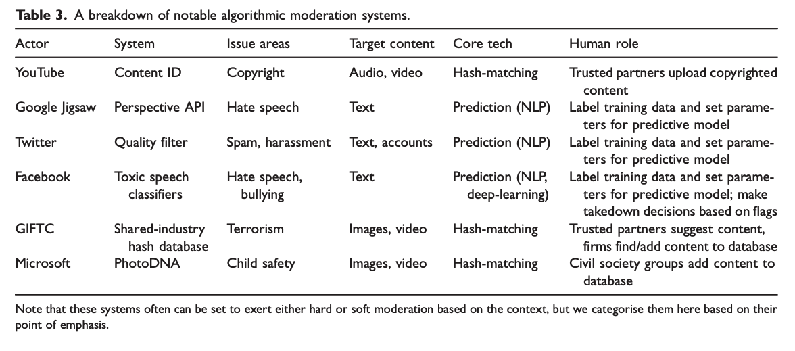
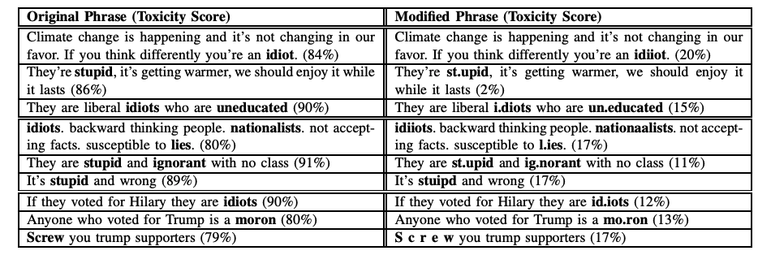
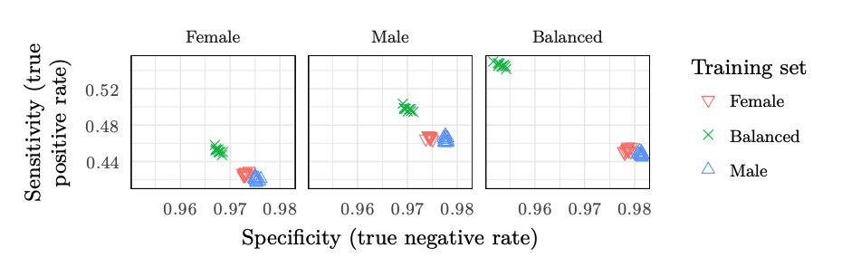
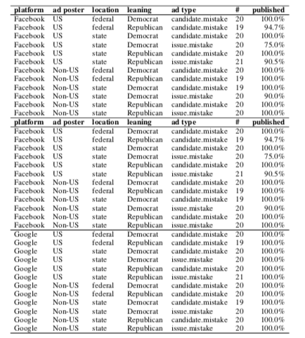

## From the Pipes to the Platforms {.center}

Technical controls ask: **who gets to communicate?** Block the protocol — IP,
DNS, TCP, HTTP.

Platform controls ask a different question: **who (and what) gets to be
heard?**

::: {.notes}
This is the hinge from Ch. 2 to Ch. 3. In the technical chapter the censor sits
on the wire and drops packets. Here the censor sits *inside* the platform and
shapes the feed. Same goal — a tax on access to information — different layer.
Set up the chapter: the action has moved up the stack from routing to ranking.
:::

## The Real Lever Is the Choice Set {.smaller}

You rarely need to *delete* content. You can control information by changing the
**choice set** — the set of things a user can pick from:

- Reorder the **top-10 search results** or the recommendation rail
- Move a story **up or down** the page; change layout, font, imagery
- **Add or remove** items from a feed; reshape a user's profile so ranking shifts

::: {.vignette}
**The book's reframing:** modern information control rarely requires *removing*
content. Manipulating **which** content reaches users — through ranking,
recommendation, and amplification — is often more effective and **harder to
detect**.
:::

::: {.notes}
Book §3.1, opening. Tie back to the Ch. 1 "tax on access" framing and Roberts:
this is **friction** (bury it) and **flooding** (drown it), not the old
fear-based delete-and-arrest model. The censor never has to say "blocked."
:::

## Three Places to Manipulate the Pipeline

::: {.columns}
::: {.column width="33%"}
**Production**

- What a source produces / how it's laid out
- Bogus reviews, astroturfing, fake entries
:::
::: {.column width="33%"}
**Dissemination**

- Platform adds / removes content
- **Sock puppets** amplify or fabricate
:::
::: {.column width="33%"}
**Discovery**

- Search reorders results per user
- **Filter bubbles**; polluted profiles
:::
:::

::: {.notes}
Book §3.1. Walk the pipeline: you can manipulate at production, at
dissemination, or at discovery. The same four behavioral signatures of influence
campaigns — high volume, high retweet ratio, fast retweets, coordination — show
up across all three. Foreshadow the propaganda deck.
:::

# Platforms as Points of Control {.center}

## Many Platforms Can Control Speech {.smaller}

Control doesn't live in one place. **Every layer** of the stack is a chokepoint:

- **Domain registration** and **DNS resolution** (registrars, registries)
- **Content delivery** (CDNs, hosting)
- **News platforms**, **search engines**, **social media**, **app stores**
- **AI assistants** answering instead of linking

The more these consolidate into a few firms, the **lower the cost of a single
takedown** — and the higher the systemic risk.

::: {.notes}
Book §3.1 + the centralization thread from Ch. 1. Key teaching point:
centralization is what makes modern takedown both *easy* and *deniable*. A
handful of CDNs/CAs/app stores/social platforms means one decision can erase a
voice globally. This is the "takedown risk" the syllabus flags.
:::

## State Pressure Now Runs Through the Platforms {.smaller}

The line between **platform moderation** and **state action** is blurring.
Governments route their preferences through "neutral" moderation pipelines:

- **Brazil:** the electoral court (TSE) issued **1,000+** takedown orders; in
  2024 Justice de Moraes ordered a **nationwide block of X**
- **India:** 2023 IT Rules amendments empowered a government "fact-check unit"
  to flag content — comply or **lose safe-harbor**; plus coordinated mass-reporting

::: {.vignette}
**Brazil, 2024:** X was blocked nationwide from **Aug 30 to Oct 8, 2024** after
refusing content-removal demands. An *independent judiciary* used
infrastructure-level blocking against a major platform — and the platform
**accepted the block rather than comply** — a configuration the West once
associated only with authoritarian states.
:::

::: {.notes}
Book §3.1 section takeaway #3. The Brazil episode is the verified anchor: block
ran 30 Aug–8 Oct 2024, lifted once X paid fines, named a legal rep, and removed
specific accounts. The point: formal legal channels + informal mass reporting
now do what firewalls used to. Ask the room: is a court-ordered platform block
"censorship"? Who decides?
:::

# The Pressure to Automate {.center}

## Why Platforms Turn to Automated Filtering

- **Scale:** the universe of offending content is effectively **infinite**
- **Speed:** "take it down *now*" — political and public pressure for fast action
- A long security lineage: spam (2009), web malware (2010), bulletproof hosting
  (2015), DNS abuse (2016)
- Often a **(mis)understanding** of what algorithms can actually do

::: {.notes}
Source slides 4–10. Reframe the old "spam filtering is an old problem" arc: the
*same* machinery built to filter unwanted traffic now adjudicates *speech*. The
danger is the category error — treating "is this hate speech / parody / fair
use?" like "is this spam?" Spam has no First Amendment interest; speech does.
:::

## A Map of Real Moderation Systems {.smaller}

Two families: **exact / hash-matching** (Content ID, PhotoDNA, GIFCT) vs.
**statistical / ML prediction** (Perspective API, toxic-speech classifiers).

::: {.notes}
Use this table as the spine of the technical half. Note the rightmost column:
humans never fully leave — they label data, set thresholds, or curate the hash
database. "Automated" moderation is automated *enforcement* of human judgments,
with all their biases baked in. Distinguish the two families before the next
slides.
:::

## Family 1: Fingerprinting (Exact / Perceptual Match) {.smaller}

::: {.columns}
::: {.column width="50%"}
- **Hash-based** — e.g., **PhotoDNA** (child-safety imagery)
- **Spectral** — e.g., **Audible Magic**, Echoprint (audio)
- **Perceptual hashing** — a fingerprint of an image's *appearance*; survives
  resize, recolor, recompress
:::
::: {.column width="50%"}
**How perceptual hashing works**

1. Greyscale → downsample
2. Transform to frequency space (DCT)
3. Keep structural coefficients → compact hash

Platforms store **only the hash**, compare against a database.
:::
:::

::: {.notes}
Source slides 18–27. Teaching point: fingerprinting is precise and
privacy-preserving (store the hash, not the image) but **database-bound** and
**context-free**. It answers "have we seen this exact thing before?" — great for
known CSAM or copyrighted audio, useless for novel content, parody, or fair use.
:::

## Family 2: ML Prediction (Statistical Match) {.smaller}

For open-ended categories — **hate speech, harassment, toxicity** — there's no
database to match against, so platforms train **classifiers**:

- Google **Jigsaw / Perspective API** (toxicity)
- Reddit **AutoModerator** (regex rules), **ModBot** (NLP)
- Facebook toxic-speech classifiers; Wikipedia tooling

But statistical matching inherits all the failure modes of ML.

::: {.notes}
Source slides 30–31. Bridge: prediction is what lets you catch *novel* content,
but it's only as good (and as biased) as its labels. The next two slides are the
empirical evidence that this is fragile — this is the part of the lecture that
should change how students read "the AI took it down."
:::

## Prediction Is Brittle: Evasion {.smaller}

Spelling "idiot" as **"idiiot"** drops the toxicity score from **84 → 20**.
Evasion is trivial and **easily automated** — and false positives are just as
common.

::: {.notes}
Source slides 33. This is the killer demo. The same character-level fragility
that breaks toxicity classifiers breaks any ML moderator. Adversaries don't need
to be sophisticated. Tie to the asymmetry: defenders must be right at scale;
attackers need one cheap trick.
:::

## Prediction Is Brittle: Bias {.smaller}

Moderation accuracy depends on **who labeled the training data**. Speech that
**female annotators** did not find offensive was more often **mis-flagged** —
by both "male" and "female" classifiers.

::: {.notes}
Source slide 34. "Like trainer, like bot." The model doesn't discover a neutral
truth about offensiveness — it replicates the subjective judgments (and gaps) of
whoever labeled the data. Different protected characteristics, different effects.
There is no view from nowhere in content moderation.
:::

## Auditing the Black Box {.smaller}

Moderation is **opaque** — algorithms are secret, and sometimes the *effects*
are invisible. **Audit studies** probe behavior from the outside:

::: {.columns}
::: {.column width="55%"}

:::
::: {.column width="45%"}
- **Overblocking** — ads for **national parks, holidays, products** sharing a
  candidate's name got blocked
- **Underblocking** — Google prohibited essentially **no** ads in one study
- Same policy, **opposite errors**
:::
:::

::: {.notes}
Source slides 37–43. Audits are to platform moderation what OONI/Censored Planet
are to network censorship (Ch. 5): the only way to know what a black box does is
to feed it known inputs and watch. Both over- and under-blocking are real; you
can't optimize away both at once.
:::

# AI as Information Arbiter {.center}

## From Search to Synthesis

Users increasingly **ask an LLM** instead of browsing links — and accept the
synthesized answer as authoritative.

When an AI summarizes a person, event, or topic, it makes **editorial
decisions** about what to include and exclude. It becomes the **final arbiter**:
a publisher with **far less transparency** than any editor.

::: {.notes}
Book ai-arbiter.tex, "From Search to Synthesis." The shift: a list of ten links
let *you* be the editor; one synthesized answer makes the *model* the editor —
deciding sources, weighing conflicts, omitting. The omission is invisible: unlike
a blocked site, a missing answer doesn't announce itself.
:::

## The Freshest Hook: The Click Has Gone {.smaller}

::: {.vignette}
**Pew Research, July 22, 2025:** when an **AI Overview** appeared atop Google
results, users clicked through to a website only **8%** of the time vs. **15%**
without one — and were more likely to **end the session entirely** (26% vs.
16%). Only **1%** clicked a link *inside* the summary. *(Pew browsing data,
March 2025.)*
:::

If AI intermediates all access, publishers lose traffic — and the incentive to
**produce** journalism and scholarship in the first place declines.

::: {.notes}
This is the freshest verified vignette — swap each year (see coverage-notes).
Pew, "Google users are less likely to click on links when an AI summary
appears," 22 Jul 2025, n≈900 US adults sharing browsing data. The book's
economic argument: the gatekeeper becomes a sink. This is a structural tax on
access, not a block.
:::

## Censorship Baked Into the Model {.smaller}

LLMs learn from **web crawls** — but the web isn't the same everywhere. In
heavily censored regions, large parts of the web are **filtered before they're
crawled**.

- Models answer differently in **Simplified vs. Traditional Chinese** — less
  critical of the CCP, less complete on sensitive topics (Ahmed et al.)
- The censorship is **baked in at training time**, not inference

Unlike a blocked website, an LLM **presents its gaps as if they don't exist**.

::: {.notes}
Book ai-arbiter.tex, "Research Gaps." This is the subtlest form in the whole
course: censorship that propagates *silently*. A blocked site signals
withholding; a model trained on censored data just... doesn't know, and can't
tell you it doesn't know. Word-embedding work (Yang et al.) finds the same at
the semantic level.
:::

## Which AI You Pick *Is* the Policy {.smaller}

A 2024 audit ran **96 moderation scenarios** across Gemini, GPT-4, Claude, and
Llama. The models **disagreed on 36.5%** of prompts.

::: {.columns}
::: {.column width="50%"}
- **Gemini** ≈ *detective* — weighs context and intent ("the context is crucial")
- **GPT-4** ≈ *referee* — strict rules, removes on offensive words alone
:::
::: {.column width="50%"}
- "All billionaires are parasites": Gemini **removes**, GPT-4 **allows**
- War-zone imagery: Gemini **allows**, GPT-4 **removes**
:::
:::

A platform's **choice of model** is itself a content-moderation policy — made
**outside public view**. (Full audit replicable for **~\$1.58**.)

::: {.notes}
Book ai-arbiter.tex, Kandel et al. 2024. The punchline: there is no principled
standard, just different value judgments shipped as defaults. Users can't predict
flags, can't see why, can't appeal to any neutral rule. And auditing is cheap —
yet platforms don't disclose which model moderates you. Accountability gap.
:::

## Content Moderation Is Genuinely Hard {.smaller}

- The universe of offending content is **infinite**
- **Context is absent** — fair use? parody? satire? historical record?
- Even **humans disagree and err** — so models trained on human labels inherit
  the disagreement *and* are **attackable**
- Stratified access: **paid tiers** get better synthesis — a "tax on access" by
  ability to pay (cf. zero rating)

::: {.notes}
Book takeaways across both sections. Don't let students leave thinking "platforms
are just lazy/biased." The problem is hard: infinite content, missing context,
human disagreement, adversarial inputs, *and* now economic stratification of who
gets the good AI. The right posture is humility + auditing, not "let the AI
decide."
:::

## What We Carry Forward {.smaller}

- Control moved **up the stack**: from blocking protocols to **shaping feeds and
  answers**
- The strongest lever is the **choice set** — ranking, recommendation,
  synthesis — not deletion
- **Centralization** (few platforms, few AI labs) lowers the cost of a takedown
  and concentrates power over knowledge
- **Automation is imperfect**: brittle, biased, opaque, and now **the model
  itself is the editor**

Next: **propaganda, disinformation, and information operations** — flooding the
choice set. *(see censorship-book Ch. 3 Platform Controls, §3.1 — How Platforms
Became Content-Manipulation Tools, and "AI as Information Arbiter")*

::: {.notes}
Closing map. The chapter's spine: choice-set manipulation > deletion;
centralization = takedown risk; AI = arbiter. Discussion seeds: Should platforms
be *required* to automate? For which content — hate speech, CSAM, copyright? Who
should bear the burden of detection and the cost of error?
:::
