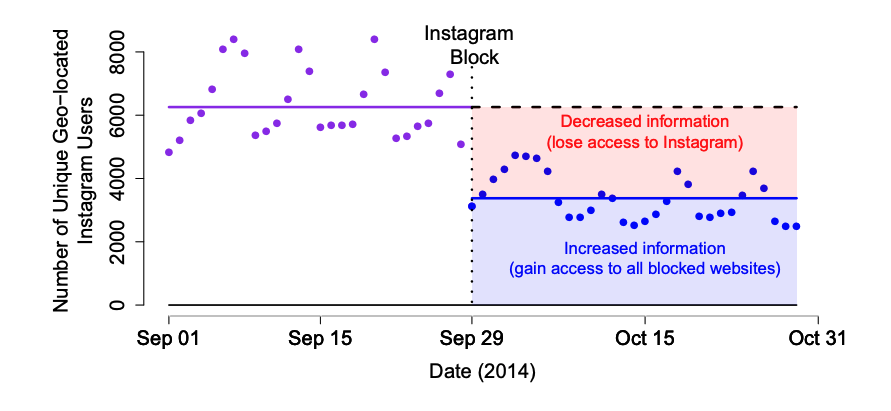
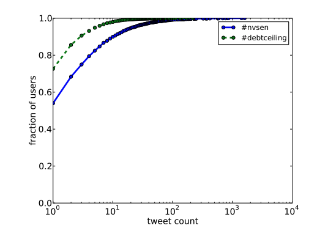
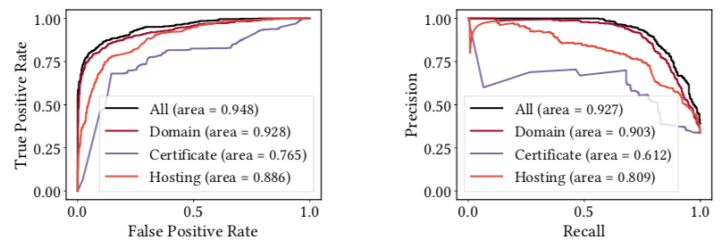

## Censorship That Doesn't Block {.center}

So far we've studied control that **removes** content. This lecture is about
control that **adds** it.

**Flooding** drowns a message out instead of taking it down — and it may be the
most dangerous form of information control we'll see all term.

::: {.notes}
Set the frame immediately. Everything in Ch. 2 and most of moderation is about
subtraction — blocking, throttling, takedowns. Flooding is addition. The censor
lets all content flow and simply buries what they don't like under noise. Tie
back to the "tax on access" thesis from the Overview lecture: flooding raises
the cost of *finding the truth* rather than the cost of *reaching a site*. Book
Ch. 3 Platform Controls, §3.2.
:::

## Roberts: Fear, Friction, Flooding

- **Fear** — make people afraid to publish or view (the old model)
- **Friction** — make content *harder* to reach (throttle, block, bury)
- **Flooding** — *dilute* the discourse with distraction and noise

This deck is the **flooding** arm. The censor amplifies, rather than removes.

::: {.notes}
Margaret Roberts, *Censored* (2018), is our spine. We covered fear and friction
earlier; flooding is the third leg. The key insight: a regime that finds direct
censorship politically costly may *prefer* to flood — it leaves no evidence of
suppression and is hard to organize against. See §3.2.
:::

## What Is Propaganda?

> "Communication designed to manipulate a target population by affecting its
> beliefs, attitudes, or preferences in order to obtain behavior compliant with
> the political goals of the propagandist."
> — Benkler, Faris & Roberts, *Network Propaganda* (2018)

Three features: **intentional** communication, **targeted** at a population, for
**political** outcomes.

::: {.notes}
Note propaganda is *old* — it long predates social media. What changed is the
barrier to entry. Anyone can now run a targeted, population-scale campaign for
near-zero cost. Distinguish from disinformation (false) — propaganda need not be
false; volume, repetition, and framing are enough.
:::

## When Blocking Backfires

{width="75%"}

Blocking can **increase** access to forbidden information for the motivated.

::: {.notes}
This is the empirical hook for *why* regimes turn to flooding. When China blocked
Instagram in 2014, Roberts's data shows about half of active users simply left —
but the other half jumped the wall with VPNs and gained access to everything
behind the Firewall, not just Instagram. Direct blocking foments the very
circumvention it's meant to prevent. Flooding avoids this backfire entirely.
See §3.2, "Flooding as the uncensored Internet."
:::

## Flooding Is the "Uncensored" Internet

In an ironic sense, flooding is what an **uncensored** environment looks like —
all content flows freely, but **strategically added volume** buries the message
you didn't want seen.

- No takedown, so **no evidence of suppression**
- No backlash, so **nothing to galvanize opposition**
- Harder to circumvent — there's no wall to climb over

::: {.notes}
This is the paradox from the book. Removing content leaves fingerprints; adding
content does not. China's "50-cent army" is the canonical example — paid or
directed commenters who don't argue with dissidents, they change the subject.
King, Pan & Roberts found the 50c posts overwhelmingly *cheerlead and distract*
rather than rebut. The goal is to redirect attention away from anything that
could spark collective action.
:::

## Why Flooding Is So Dangerous {.smaller}

::: {.columns}
::: {.column width="50%"}
**It exploits human limits**

- Our attention is **finite**; flooding targets exactly that constraint
- Disorientation: blurs **fact vs. fiction**
- Distraction: redirects attention from anything that could spark **collective action**
:::
::: {.column width="50%"}
**It evades the law**

- Rarely **illegal** — no single post breaks a rule
- Harm is in the **aggregate**, not any one message
- Hard to **detect** and hard to **regulate**
:::
:::

How do you regulate "too much information"? Where's the line between speech and
censorship-by-flooding?

::: {.notes}
The book's central argument for why flooding may be the *most* dangerous form:
legal frameworks are built around removing specific harmful content. Flooding has
no specific harmful content to point at. When search results push a story to page
ten, at what point is that censorship? No clear answer — which is exactly what
makes it work. §3.2 takeaways.
:::

## Flooding Predates the Internet

The attention economy was already flooding us before the manipulators arrived.

- **Press releases** as flooding — tobacco (Philip Morris), pro sports (NFL)
- Shrinking news cycle → media **incentivized to flood** in a battle for attention
- Manipulators just **add** to an environment already saturated with noise

::: {.notes}
Important to de-exoticize this. The attention economy means online newspapers are
already flooding us before any bad actor shows up. That's *why* it's so easy for
others to come in and add disorientation — the channel is already noisy. Book
§3.1, "the rise of the attention economy."
:::

# How Propagandists Behave Online {.center}

Volume, repetition, and timing — not necessarily falsehood.

## The 2012 Insight: Behavior, Not Content

A study we ran in 2012 (*#bias*, ICWSM) on U.S. political hashtags found
**behavioral signatures** of "hyperadvocacy" — *without analyzing the content at all*:

- **High tweet volume**, in bursty spikes
- **High ratio of retweets** to original content
- **Short time** between an original post and its retweet
- **Coordination / collusion** across accounts

::: {.notes}
This is the prescient point the book emphasizes (§3.1, "How did we get here?").
Influence campaigns need not lie — volume, repetition, and timing shape opinion
on their own. And you can detect them from *behavior* alone. Datasets were the
2010 Nevada Senate race (#nvsen) and the debt-ceiling debate (#debtceiling).
Caveat: that specific classifier likely no longer works as platforms changed —
the *principle* is what matters.
:::

## Posting Is Wildly Skewed

{width="62%"}

A handful of accounts can **manufacture the appearance** of a groundswell.

::: {.notes}
Read the CDF: for #nvsen, ~50% of users posted exactly once, while a tiny tail
posted hundreds of times. That heavy tail is where coordinated amplification
lives. This is the quantitative basis for "manufactured consensus" — a few
accounts plus fast retweets simulate a movement that isn't there.
:::

## From #bias to Information Operations

The 2012 signatures recurred at scale:

- **2016** — Russian (IRA) accounts on Facebook/Twitter posed as grassroots
  Americans; mostly **polarizing framing**, not outright lies
- **2020** — COVID-19 health misinformation flooded platforms; enforcement lagged
- **2022** — Brazil's electoral court issued **1,000+** takedown orders; X later
  **blocked nationwide** (2024) for non-compliance

::: {.notes}
The book traces this arc in §3.1. The throughline: amplification, collusion, and
coordinated framing — first measured in 2012 — now recur across very different
political contexts, increasingly backed by formal legal mechanisms (Brazil's TSE,
India's IT Rules fact-check unit). The tactics are stable; the actors and venues
change.
:::

## Bots: Automated and Human

- **Automated bots** — scripted accounts, cheap and scalable
- **"Human bots"** — paid/directed people (e.g., the 50-cent army, troll farms)
- Hybrid: humans steering AI-generated content at machine speed

The line between automation and coordination is **blurring** — and so is our
ability to measure downstream effects.

::: {.notes}
Stress that "bot" is overloaded. The most effective operations are often
human-directed, not fully automated. And we genuinely don't understand the
*downstream effects* well — exposure does not equal persuasion. Keep students
skeptical of breathless "bots swung the election" claims; the honest answer is
the effects are not fully understood.
:::

# Disinformation {.center}

The false-content cousin of flooding.

## What Counts as Disinformation? {.smaller}

**Disinformation** = nonaccidentally misleading information (Fallis 2015).
Three conditions:

1. It must carry **information**
2. It must create **false beliefs**
3. It must do so **intentionally**

::: {.columns}
::: {.column width="50%"}
Distinguish from:

- **Misinformation** — false, but *not* intentional
- **Satire** — false, but not meant to deceive
:::
::: {.column width="50%"}
**Partisan bias ≠ disinformation.** One-sided is not the same as false-and-intentional.
:::
:::

::: {.notes}
Definitions matter because detection depends on them. The hard cases live at the
boundaries: disambiguating disinformation from satire is brutal for automated
systems (Poe's Law). And the most politically charged mistake is conflating
partisan bias with disinformation — a recurring move in moderation debates.
Book §3.1.
:::

## Who Spreads It, and Why

::: {.columns}
::: {.column width="50%"}
**Who / Why**

- Profit-seekers (Macedonian clickbait)
- Parties, PACs, governments
- Investors, speculators, insiders
- Trolls, hate groups, conspiracists
:::
::: {.column width="50%"}
**How / Why possible**

- Bots, hashtags, channels
- Framing & amplification
- Decline of **local news**, consolidation
- Attention economy ("reporter catnip")
:::
:::

::: {.notes}
The 2016 Macedonian teens are the classic "it's just business" case — pure profit,
no ideology. Motives span profit / politics / status. The structural enablers
matter most for the course: the collapse of local news and platform consolidation
create the data voids and attention dynamics that disinformation exploits.
:::

## Effects of Propaganda

- **Induced misperceptions** — people believe false things
- **Disorientation** — inability to tell truth from non-truth (cynicism)
- **Distraction** — Roberts's **flooding**: change the subject

The goal is often **not** to make you believe a specific lie — it's to make you
believe **nothing** and disengage.

::: {.notes}
This is the most important slide for the "why it works" story. The sophisticated
goal isn't persuasion, it's *demobilization*: a disoriented public that trusts no
source is easier to govern than a persuaded one. Connect back to Roberts —
distraction *is* flooding. Source: Benkler et al. 2018.
:::

## Other Manipulation Tactics

- **Sock-puppets** — fake accounts that create or amplify content
- **Astroturfing** — fake grassroots; manufactured consensus
- **Bogus reviews**, false Wikipedia entries
- **Search manipulation**, polluting a user's browsing history/profile

All target one of three things: your **choice set**, the **presentation** of
options, or the **content** itself.

::: {.notes}
Book §3.1 names the three levers a manipulator pulls: (i) change the available
choices (e.g., the top-10 search results), (ii) change presentation/layout
(ordering, imagery, font), or (iii) change semantic content (fabrication,
sock-puppet endorsements). Polluting a user's profile changes how *future*
results rank for them — a bridge to the personalization/filter-bubble lecture.
:::

# Detecting Disinformation {.center}

Can unwanted content be caught the way we caught spam?

## Disinformation Is the New Spam {.smaller}

The same playbook that beat **spam** may apply here:

- Content analysis is **slow and error-prone**; blacklists go **stale**
- Instead, profile the **infrastructure-level behavior** of the senders
- Email spam (SNARE, 2009): network-level features matched manual blacklists —
  **fully automated**

**Question:** does disinformation *infrastructure* look different from legitimate news?

::: {.notes}
The methodological bet: just as we learned to detect spam from *how* it's sent
(IP reputation, sending patterns) rather than *what* it says, maybe disinformation
sites have telltale infrastructure. Why this matters: early detection. Once
disinformation spreads, in some sense it's already too late — content-level
debunking arrives after the damage.
:::

## Infrastructure Signals of Disinformation {.smaller}

Dataset: **769** disinformation sites (FactCheck, Snopes, PolitiFact, NewsGuard…)
vs. **533** authentic news sites.

::: {.columns}
::: {.column width="50%"}
- **Domain / DNS** — registrar, registrant, registration age, nameserver
- **Certificates** — Subject Alternate Name counts, misconfigurations
:::
::: {.column width="50%"}
- **Hosting** — CMS and plugins: WordPress on **82%** of disinformation sites vs. **20%** of news sites
- News sites lean on **custom** plugins; disinfo sites on cheap themes
:::
:::

::: {.notes}
The features are deliberately content-agnostic — they don't read the article. A
nice surprise: legitimate news orgs have *long* SAN lists (lots of shared certs),
which itself is a signal. The WordPress gap is the most intuitive one. The point
isn't any single feature but the aggregate fingerprint.
:::

## It Works — Mostly {.smaller}

{width="80%"}

::: {.notes}
ROC on the left, precision-recall on the right. "All" features combined hit
AUC ~0.95 — strong for a fully automated, content-free classifier. Certificates
alone are weakest. The honest caveat: this is an *early-warning* signal, not
ground truth, and adversaries adapt (infrastructure can be changed once it's a
known tell). Same arms-race dynamic as spam.
:::

## The Hard Part Is Definition {.smaller}

Detection is downstream of a problem we can't fully solve:

- What *is* disinformation? Everything false? False-made-to-look-true?
- Do **motives** matter (profit vs. political vs. trolling)?
- **Partisan bias is not disinformation** — but classifiers blur them
- **Early detection** vs. free expression — false positives silence real speech

::: {.notes}
End the detection arc on humility. The technical problem is tractable; the
definitional and normative problems are not. Every detector encodes a contested
definition, and aggressive early detection trades off against over-removal of
legitimate speech. This tees up the content-moderation lecture.
:::

# The 2024–2026 Picture {.center}

Flooding meets generative AI.

## AI-Generated Flooding {.smaller}

::: {.vignette}
**OpenAI's June 2025 threat report** disclosed that the company disrupted **10
malicious AI campaigns** in the prior three months and banned the associated
accounts — **four likely originating in China**. One operation, **"Sneer Review,"**
used ChatGPT to generate posts *and* their own replies across TikTok, X, Reddit
and Facebook to fake "organic engagement." Russia- and Iran-linked operations were
also disrupted. *(OpenAI, "Disrupting malicious uses of AI," June 5, 2025.)*
:::

Generative AI **lowers the cost** of volume, repetition, and persona-building —
the exact levers flooding depends on.

::: {.notes}
This is the freshest verified hook (June 2025). Tie it straight back to the 2012
signatures: "Sneer Review" posting a comment *and* its own replies is manufactured
consensus — the same behavior, now automated. The recurring finding across OpenAI
and Meta reports: AI rarely invents *new* tactics; it scales the old ones (volume,
fake personas, fast coordinated timing). Source links in coverage-notes.
:::

## Grooming the Chatbots {.smaller}

A newer flooding target: not humans, but the **models themselves**.

- NewsGuard (Mar 2025): the Kremlin-linked **Pravda network** (~150 sites,
  **3.6M+ articles in 2024**) seeds the web so chatbots repeat its claims —
  "**LLM grooming**"
- NewsGuard found chatbots echoed Pravda claims in **~33%** of relevant prompts
- **Contested:** a 2025 Harvard *Misinformation Review* study argues this reflects
  **data voids**, not successful manipulation — chatbots rarely cite the sources

::: {.notes}
A perfect "flooding evolves" slide and a good teaching tension. The flooding target
moves up the stack: pollute the *training and retrieval data* so the AI launders
your narrative. But teach the contested status honestly — the Harvard rebuttal
says the effect appears mostly when prompts probe obscure details with no
mainstream coverage (a data void). The verified facts (the network exists, the
NewsGuard number, the rebuttal exists) are what we assert; the causal claim is open.
:::

## Takeaways {.smaller}

- **Flooding** controls information by **drowning**, not blocking — and may be the
  most dangerous form because it's legal, deniable, and hard to detect
- **Propaganda** works through **volume, repetition, and timing** — not necessarily
  falsehood
- The behavioral signatures (high volume, retweet ratio, fast/coordinated posting)
  were measurable in **2012** and recur today, now **AI-accelerated**
- **Disinformation** is detectable from **infrastructure**, but **definition** is the
  real bottleneck

## Coming Up

Next: the **AI arbiter**, **content moderation**, and **personalization** — the
*subtraction* and *ranking* side of platform control.

*See censorship-book Ch. 3 Platform Controls, §3.4 (Propaganda) + §3.2 (Flooding).*

::: {.notes}
We did the additive side (flooding/propaganda). Next decks do moderation
(subtraction), the AI-as-arbiter question, and personalization/filter bubbles.
Pointer for reading: Ch. 3, §3.2 and the propaganda framing in §3.1/§3.4.
:::
