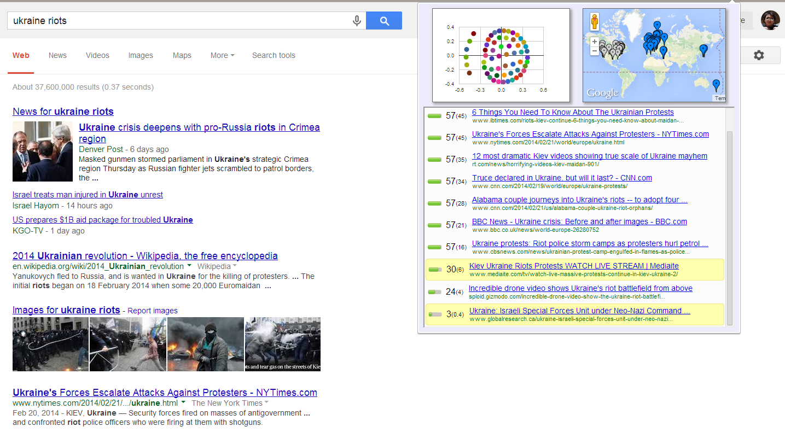
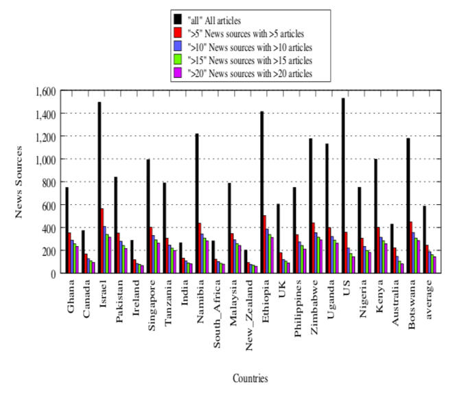

## "A Squirrel Dying in Front of Your House" {.center}

> "A squirrel dying in front of your house may be more relevant to your interests
> right now than people dying in Africa."

The line (attributed to Mark Zuckerberg in Eli Pariser's *The Filter Bubble*, 2011)
is the whole problem in one sentence: **relevance is decided for you, by an
algorithm, and you never see what it left out.**

::: {.notes}
Open with the squirrel line. It captures the engagement logic of personalization:
the feed optimizes for what holds *your* attention, not for what you ought to see.
Pariser coined "filter bubble" around this. The pedagogical move for today: treat
personalization not as a feature but as a **form of information control** — one that
works through omission and amplification rather than a visible block. See
censorship-book Ch. 3 Platform Controls, §3.7.
:::

# Personalization Is a Tax on Access {.center}

## Not All Control Is Overt

Most of this course is about visible control — blocks, takedowns, shutdowns. **Personalization
is different:** it shapes what you see *quietly*, in the background.

- It optimizes for **engagement**, but in doing so it decides **visibility** and **relevance**
- It is **rarely transparent** — you can't see the results it withheld
- It works through **omission and amplification**, not a "BLOCKED" page

This is a textbook case of **friction**: not a wall, but a quiet **tax on access** to
the information you didn't get recommended.

::: {.notes}
Tie back to the Roberts taxonomy from the Intro deck: Fear / Friction / Flooding.
Personalization is friction (content is *harder* to reach because it's buried or never
surfaced) and it sets up flooding (data voids, later). The key analytic claim from the
book: personalization is information control *because* the user can't observe what was
filtered. No backlash, no martyr, full deniability — "it's just the algorithm."
:::

## Personalization Is Ubiquitous

::: {.columns}
::: {.column width="50%"}
- **Search** results
- **Social feeds** (ranking, "For You")
- **News** portals and aggregators
:::
::: {.column width="50%"}
- **Shopping** — goods and services
- **Media** — music, movies, video
- **Maps / local** results
:::
:::

Anywhere you get a **personalized recommendation**, ask: *what results are being
filtered out, and would I ever know?*

::: {.notes}
The book's point: the same mechanism spans every content type. Most of it feels benign
or even helpful — an Old Navy search in Santa Barbara vs. Amherst returns your local
store. That's the wedge: the *same* machinery that gives you the nearest store can give
you a different reality on "Egypt," "vaccines," or a ballot measure. Benign and
political personalization are the same code path.
:::

## From Benign to Political

A search for **Old Navy** returning your nearest store is harmless personalization.

A search for **"Egypt"** that returns *tourism* for one user and *current events /
protests* for another is **not** — the same query yields different realities.

::: {.vignette}
The boundary between **personalization** and **censorship** is blurry by design. In the
best case you merely miss a relevant result. In the worst case, relevant information
becomes **practically undiscoverable** — and you have no way to know it's missing.
:::

::: {.notes}
This is the core conceptual slide. Personalization sits on a continuum with censorship;
there's no bright line. The censor doesn't have to remove content — making it
un-surface for the people who'd care is enough. Note that the *user's lack of awareness*
is what makes it powerful: undocumented friction is the most effective friction.
:::

## Filter Bubbles and Echo Chambers {.smaller}

**Eli Pariser (2011):** algorithmic personalization can isolate users in ideological
**echo chambers** — you see more of what you already agree with, less of what challenges
you, in a self-reinforcing **feedback loop**.

But the story has gotten **more complicated**:

- Newer research finds users *are* often exposed to diverse perspectives —
  and then **selectively engage** with the reinforcing ones
- The bubble may be as much **human choice** as **algorithmic enclosure**

::: {.notes}
Be honest with students that the strong 2011 filter-bubble thesis has been partly walked
back. The mechanism is real, but "the algorithm traps you" is too clean. Selective
exposure (a human bias) and algorithmic curation interact. The book flags this explicitly
— don't oversell Pariser. The interesting research question is disentangling the two.
:::

## The Bubble Has Moved: Passive Signals {.smaller}

::: {.columns}
::: {.column width="55%"}
**TikTok's "For You" page** curates on **passive behavioral signals** — watch time,
scroll speed, rewatches — *not* declared interests or your social graph.

- Highly personalized, highly **opaque**
- Users can be pulled toward reinforcing or **radicalizing** content without
  understanding why
:::
::: {.column width="45%"}
**Closed platforms** (WhatsApp, Telegram) build bubbles a different way: through
**group membership**, with content **forwarded peer-to-peer**, unlabeled and
unmoderated — potent around **elections and crises**.
:::
:::

::: {.notes}
Two updates the book makes to the 2011 picture. (1) Engagement-optimized feeds like
TikTok don't need you to declare anything — passive signals are enough, and the system
can't really explain itself. (2) In much of the world the "bubble" isn't algorithmic at
all; it's a WhatsApp/Telegram group with no external moderation. Both matter for
elections. This sets up the regulatory vignette.
:::

## 2025: Regulators Demand the Algorithm Open Up

::: {.vignette}
On **October 24, 2025**, the **European Commission** preliminarily found **TikTok and
Meta** in breach of the **Digital Services Act** for failing to give vetted researchers
adequate access to platform data (DSA **Article 40**) — the access needed to study how
recommender systems shape what users see. A confirmed finding can trigger fines up to
**6% of global annual turnover**; the delegated act on researcher data access took
effect **October 29, 2025**. *(Source: European Commission press release IP/25/2503.)*
:::

The fight is now explicitly about **algorithmic transparency** — can outsiders even
*measure* the bubble?

::: {.notes}
This is the freshest verified hook (swap annually — see coverage-notes). Teaching point:
the policy response to personalization-as-control is to force *measurability*. You can't
regulate what you can't observe, and platforms tightly control access to exactly the data
that would let researchers audit recommendation. The DSA Article 40 data-access regime is
the live battleground. This connects forward to the Legal chapter (Ch. 4, DSA).
:::

# Can We Measure the Bubble? {.center}

## Auditing Recommendation Systems Is Hard

Platforms tightly control access to algorithmic transparency and usage data. Researchers
improvise:

- **Sock-puppet accounts** — synthetic profiles to probe what each "user" is shown
- **Adversarial queries** — vary the input to expose differences
- **Data donations** — volunteers contribute their own results

The recurring obstacle: **the platform is the thing you're trying to audit**, and it
controls the data.

::: {.notes}
Frame measurement as an adversarial, methods-heavy problem — the same flavor as Ch. 5.
The DSA fight (previous slide) is precisely about whether the sock-puppet / data-donation
approach can be replaced by sanctioned data access. Now we'll look at one concrete audit
method from our own work: Bobble.
:::

## Bobble: Seeing What Was Filtered {.smaller}

::: {.columns}
::: {.column width="48%"}
A **browser plugin** (Bobble, Xing et al., PAM 2014). When a user runs a Google search,
Bobble also runs the **same query** from distributed servers worldwide, **as different
users, with different histories**.

It then highlights results that *would have appeared* for someone else — the
**results you didn't see**.
:::
::: {.column width="52%"}

:::
:::

::: {.notes}
Walk through the design: execute the query from many vantage points (locations,
profiles, logged-in vs. out), then diff the result sets. The UI surfaces, in yellow, the
results filtered from *this* user but visible elsewhere. The method asks three questions:
what shows up on page one, where it ranks, and — when something doesn't appear — why.
This is the concrete instantiation of "what results am I not seeing?"
:::

## What Causes the Differences? {.smaller}

::: {.columns}
::: {.column width="50%"}
**Static features**

- Location (IP address)
- Browser, OS
- Logged in vs. out
- Gender, age
:::
::: {.column width="50%"}
**Historical features**

- Search history
- Click history
- Browsing history
:::
:::

Disentangling **which** factor drives an inconsistency is the hard part — attribution,
not just detection.

::: {.notes}
The study (≈200 users, 75,000+ queries, nine months in 2012) tried to attribute
inconsistencies to causes. The two big buckets: *who you are* (profile) and *where you
are* (geography). Establishing causality is genuinely hard — these factors covary. Caveat
the students: this is 2012-era data; the specific numbers likely look different today,
but the method and the phenomenon persist.
:::

## Bobble Findings: Geography Dominates {.smaller}

From the 2012 study (caveat: a decade old, worth revisiting):

- **>85%** of queries had a result **absent** from the user's set but in the **top 10**
  for some other geography
- **Geography** explained more inconsistency than **profile**
- Logged-in vs. logged-out often changed the **order** of results (incl. what's on
  page one) more than the **set**

::: {.vignette}
**"The Internet" is not one thing.** Where you search can change what is even
*discoverable* — and rank changes alone decide what most users ever click.
:::

::: {.notes}
Headline: geography was the bigger lever, and even when the *set* of results was stable,
*ranking* shifted — and ranking is destiny, since almost no one leaves page one. So
"censorship by ranking" doesn't require removing anything. Stress the caveat that this is
old data; Google has changed a lot. The durable lesson is the framing, not the 2012
percentages.
:::

# Personalization Can Be Attacked {.center}

## Adversarial Personalization {.smaller}

If you can **pollute a user's profile** (their inferred history), you can move content
**into or out of** their results — **without editing a single underlying page.**

- Search engines deliver **inconsistent** results across users, and to the *same* user
  over time
- An attacker who shapes those signals can **sway opinion** on products, candidates,
  or ballot measures

*"Take This Personally: Pollution Attacks on Personalized Services"* (Xing et al.,
USENIX Security 2013) demonstrated this in practice.

::: {.notes}
Key escalation: personalization isn't just a passive side effect — it's an *attack
surface*. The corpus is untouched; the attacker manipulates the *profile* (or the
signals the recommender reads) so a target sees different results. This is information
control without takedowns — perfectly deniable. Note the same observed inconsistency
(CA vs. GA results on a ballot proposition) can be a research finding *or* a weapon.
:::

## Data Voids {.smaller}

A **data void** is a query that returns **little authoritative content** — an obscure
health term, a freshly coined phrase, a breaking-news topic.

- Coined by **Golebiewski & boyd** (Data & Society, 2018)
- Bad actors **fill the void** with biased or false material, using **adversarial SEO**:
  keyword stuffing, coordinated backlinking, micro-site cloning
- Especially dangerous during **breaking news** and **public-health crises**, before
  authoritative sources catch up

::: {.notes}
Data voids are the flip side of the bubble: instead of burying content, you *plant* it
where nothing trustworthy exists yet. Coin a term ("crisis actor," an invented
syndrome), then own the search results for it. This is flooding/manipulation in the
Roberts sense. A 2025 arXiv study (Data Voids and Warning Banners on Google Search)
found Google shows a warning banner for only ~1% of queries — voids largely go
unflagged. Generative-AI chatbots reproduce some disinformation for the same reason:
they answer into voids.
:::

## Data Voids in News Portals {.smaller}

::: {.columns}
::: {.column width="50%"}
A Google News study (≈3,800 English sources, 5 months, 22 countries) found
personalization narrows the news you see:

- **20%** of sources produced **80%** of articles in some countries
- Source counts ranged from **~1,500 (Israel)** to **~200 (New Zealand)**
- Some queries returned **no results** in one country but stories in another — i.e.,
  **filtering**
:::
::: {.column width="50%"}

:::
:::

::: {.notes}
This is the data-void / filter-bubble phenomenon in news, with real numbers. The plot:
the tall black bars are *all* sources, but the colored bars (sources with more than 5,
10, 15, 20 articles) are much shorter — a few sources dominate the feed. Articles-per-
source ranged ~130:1 (NZ, Switzerland — low diversity) to ~35:1 (US — more diverse).
Some countries even saw complete filtering of certain queries. "The Internet looks
very different to different people" — empirically.
:::

## Takeaways {.smaller}

- Personalization is **quiet information control** — it shapes what you see by
  **omission and amplification**, not visible takedowns, which makes it **hard to detect
  and hard to regulate**
- Personalization can be **attacked** — pollute a profile or exploit a **data void** and
  you move content without editing the corpus
- Empirical audits find **less source diversity than users assume**, varying sharply by
  **country and profile** — *"the Internet" is not one thing*

::: {.notes}
These are the book's three section takeaways verbatim in spirit. Land the synthesis:
personalization is friction + flooding combined, it's deniable, it's an attack surface,
and the policy frontier (DSA Article 40) is about making it *measurable* at all.
:::

# Where This Connects {.center}

Personalization is the **subtle** end of platform control — moderation and information
operations are the overt ends.

Next: how all of this is **governed and contested** — platform transparency law
(EU **DSA**) in **Ch. 4 (Legal & Economic Controls)**.

*See censorship-book Ch. 3 Platform Controls, §3.7 (Personalization).*

::: {.notes}
Closing pointer. Locate today in the larger map: Ch. 3 covers content moderation
(overt), information operations (flooding), and personalization (quiet friction).
Personalization is the hardest to see and therefore the hardest to regulate — which is
exactly why the measurement and transparency-law threads (Ch. 5, Ch. 4) matter. End by
reminding them of the squirrel.
:::
