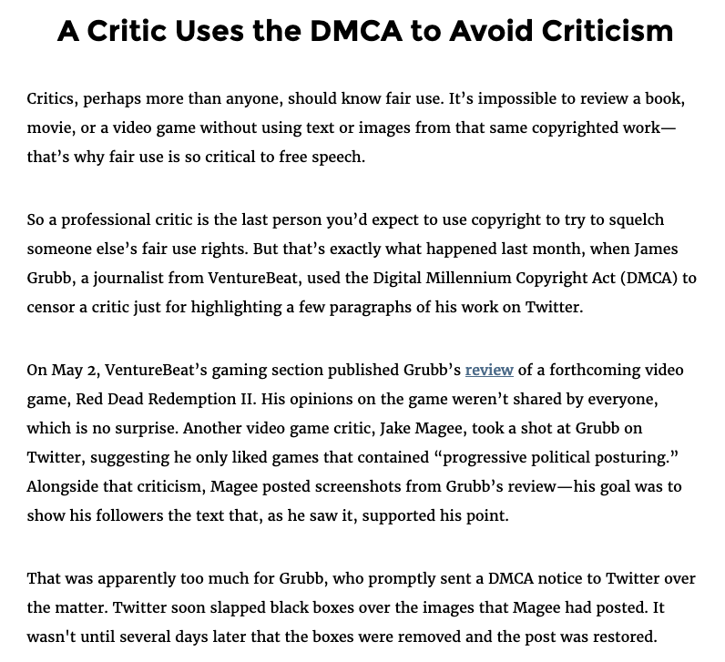
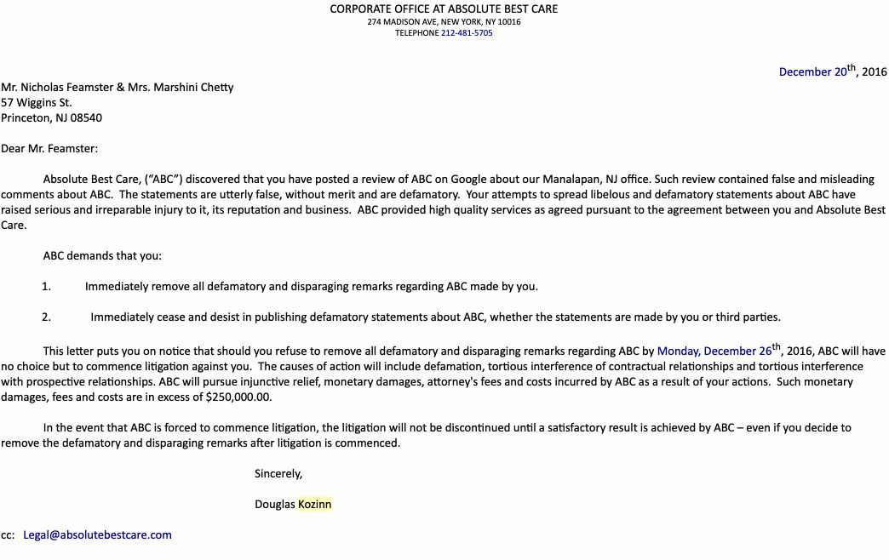

## Behind Every Technical Control Is a Law {.center}

So far we have studied the *pipes*: filtering, DNS poisoning, throttling. But
the censor rarely touches the pipe directly.

This week: **law as information control** — how rules about who is liable for
speech do the work that a firewall used to do.

::: {.notes}
Open by connecting to the technical chapters. The state usually does not need to
run a DPI box if it can make a platform afraid of liability. Law is a lever that
moves the platform, and the platform moves the content. Frame the whole deck as
"the tax on access," now levied through legal exposure rather than packets. See
censorship-book Ch. 4, §4.1.
:::

## The Central Question

> To what extent is an ISP or platform **responsible for the speech of its
> users**?

The answer is the load-bearing wall of the entire content-moderation system.

- Make platforms **fully liable** → they over-remove ("when in doubt, take it
  down")
- Make them **fully immune** → harmful content stays up, no accountability
- Every regime in this lecture is a different answer to this one question

::: {.notes}
This is the spine of the whole deck (book §4.1 opening). Intermediary-liability
rules define what platforms are responsible for, and therefore what they will
moderate. Small changes to these rules cascade through the entire information
ecosystem. Keep coming back to this trade-off.
:::

## Law Taxes Speech Without Banning It {.smaller}

The law rarely says "this idea is illegal." More often it raises the **cost** of
speech until platforms self-censor:

- **Intermediary liability** — make the host pay, and the host removes
- **Takedown regimes** — a notice is cheaper to obey than to fight
- **Litigation threats** — fear and legal fees, not a verdict, do the silencing

This is Roberts's **friction** in legal form — and a **tax on access to
information** levied through legal exposure.

::: {.notes}
Tie back to the Intro deck's Fear / Friction / Flooding taxonomy and the "tax"
framing. The book stresses: the levers are usually indirect (fear, intimidation,
cost) rather than a direct ban. Even copyright — a law about money — gets
weaponized to silence. That is the through-line for the SLAPP and DMCA examples
later.
:::

# Intermediary Liability {.center}

CDA §230 and its global counterparts

## CDA §230: The 26 Words That Made the Internet {.smaller}

The **Communications Decency Act (1996)** aimed to protect minors; most of it was
struck down. One section survived:

::: {.vignette}
**§230(c)(1):** "No provider or user of an interactive computer service shall be
treated as the publisher or speaker of any information provided by another
information content provider."
:::

- Platforms get **safe harbor** — not liable for users' speech
- Also lets them moderate in good faith **without** becoming a "publisher"
- Still law today — and under attack from **both** political directions

::: {.notes}
The "26 words" framing (Kosseff). §230 is *why* user-generated content at scale
exists — policing billions of posts for liability would be impossible. The
right says it lets platforms suppress conservative views with immunity; the left
says it lets platforms profit from harm without accountability. Book §4.1.
:::

## Reno v. ACLU (1997): The Internet Gets Free-Speech Rights

The first Supreme Court ruling on regulating Internet content.

- Struck down the CDA's anti-indecency provisions as **unconstitutionally
  overbroad**
- Online speech gets **strong First Amendment protection** — treated like
  **print**, not like broadcast
- Preserved narrow carve-outs (obscenity, child sexual abuse material)

::: {.notes}
The key doctrinal move: the Internet is like a printing press (high protection),
not like a TV station (heavily regulated scarcity-era medium). This is why the
US baseline is so speech-protective compared to the EU. Book §4.1.
:::

## FOSTA/SESTA (2018): The First Crack in §230 {.smaller}

The first major carve-out in two decades.

- Removes §230 immunity for sites that **knowingly facilitate sex trafficking**
- Aimed squarely at **backpage.com**
- Critics: a **"censorship bill"** — a slippery slope of carve-outs
- **Implication:** liability without notice forces platforms to deploy
  **large-scale automated detection** — which **favors incumbents**

::: {.notes}
The deep point (book §4.1): once you make a platform liable, you implicitly
mandate the detection technology to find the content. Only big platforms can
afford that — so liability rules consolidate market power. This is the recurring
"favors incumbents" theme. The newest US carve-out is the TAKE IT DOWN Act
(signed May 2025): platforms must remove nonconsensual intimate images,
including AI deepfakes, within 48 hours.
:::

## §230 Reform: Everyone Hates It, Nobody Fixes It

Reform proposals all collide with hard problems:

::: {.columns}
::: {.column width="50%"}
**Proposals**

- Condition immunity on "neutral" moderation
- Strip immunity for **algorithmically amplified** content
- More content-specific carve-outs
:::
::: {.column width="50%"}
**Problems**

- "Neutral" is undefinable
- *Everything* is algorithmically ranked
- More carve-outs → slippery slope
:::
:::

Net effect of weakening §230 could be **more** removal, not less.

::: {.notes}
Despite endless rhetoric, §230 is essentially unchanged since FOSTA/SESTA (book
§4.1). Weakening immunity pushes platforms toward "when in doubt, take it down,"
shrinking speech. Smaller platforms get hit hardest. Consensus is impossible
because the left and right want opposite fixes.
:::

## Who Decides? Platforms vs. Government {.smaller}

Two 2024 Supreme Court cases bracket the question:

- **Moody v. NetChoice (2024):** Texas/Florida laws banning "viewpoint-based"
  moderation. Court: platform curation is **expressive, First-Amendment
  protected** — the state cannot compel platforms to carry speech.
- **Murthy v. Missouri (2024):** Did the government **coerce** platforms to
  remove COVID/election content? Court ducked on **standing** — the
  **jawboning** line stays unsettled.

The constitutional boundary between **persuasion** and **coercion** is still
open.

::: {.notes}
Moody: platforms have their own speech rights — Texas HB20 / Florida SB7072
can't force carriage (remanded for feature-specific analysis; as of mid-2025
still in district courts). Murthy: government can flag content, but cannot
threaten — yet the Court never reached the merits. Book §4.1 "jawboning." These
are the two poles: can the state force platforms to keep speech up, and can it
pressure them to take speech down?
:::

## Intermediary Liability Is Not Universal

- §230 is a **US** rule — the global baseline varies sharply
- EU **e-Commerce Directive** → now the **DSA**: conditional liability + duties
- Some countries' **outdated laws** blur "intermediary" vs. "user," leaving
  jurisdiction unclear
- A platform's removal behavior is set by the **strictest** regime it must obey

::: {.notes}
Set up the DSA section and the California/Brussels effect. The key idea: a global
platform tends to comply with whoever is most demanding, so one jurisdiction's
rules become everyone's default. Book §4.1.
:::

# Copyright as a Censorship Tool {.center}

DMCA §512 and the takedown machine

## DMCA §512: Safe Harbor in Exchange for Takedowns {.smaller}

The **Digital Millennium Copyright Act (1998)**:

- Bans tools that **circumvent** copyright access controls (§1201)
- **Title II / §512 safe harbor:** ISPs and hosts are **not liable** for users'
  infringement — *if* they **act on takedown notices**
- Notice-and-takedown is **cheap to obey, expensive to contest** → bias toward
  removal

::: {.notes}
§512 is the template for the modern takedown economy: send a notice, content
comes down, the burden of restoring it falls on the poster (counter-notice). The
asymmetry is the censorship risk — it is far easier to take something down than
to keep it up. Book §4.1.
:::

## The $1 Billion Question: Cox v. Sony {.smaller}

::: {.vignette}
**March 25, 2026:** In *Cox Communications v. Sony Music Entertainment*, the
**Supreme Court reversed** a **$1 billion** verdict against Cox for not
disconnecting subscribers flagged in copyright notices. An ISP is **not**
contributorily liable for "merely providing a service... with knowledge that it
will be used by some to infringe." A concurrence warned this guts the incentive
to act on notices.
:::

The stakes of §512: comply and you may have to **cut off your own customers**.

::: {.notes}
This is the freshest, most on-point hook in the deck — a 9-0 SCOTUS decision
(March 25, 2026) directly about intermediary liability and DMCA. The original
2019 jury verdict ($1B against Cox for ignoring 10,000+ notices) is the book's
example; the case has now resolved at the Supreme Court. Teaching point: the
threat of liability was pushing ISPs to terminate users on the basis of
unproven notices — exactly the over-removal dynamic. Swap this hook next year
only if a bigger §512 case lands. Source: SCOTUS opinion 24-171.
:::

## Copyright Weaponized to Silence Critics {.smaller}

You cannot review a book, film, or game without quoting it — **fair use** exists
for exactly this. Yet copyright is routinely abused to censor:

::: {.columns}
::: {.column width="55%"}

:::
::: {.column width="45%"}
- **SDMI / Felten (2001):** RIAA threatened DMCA suit to **block security
  research**; backed down after EFF + outcry
- **SIGCOMM:** used copyright to silence a researcher **critiquing its own
  review process**
:::
:::

::: {.notes}
The pattern: copyright is a law about money, but it is a fast, cheap censorship
hammer because the notice regime defaults to removal. Felten/SDMI is the classic
academic-freedom case; the SIGCOMM example shows even our own community does it.
Book §4.1. Fair use protects the speech in principle, but the takedown happens
first and the fight comes later.
:::

## SLAPP: Suing People into Silence {.smaller}

A **Strategic Lawsuit Against Public Participation** is not meant to be *won* —
it is meant to **exhaust** the critic.

::: {.columns}
::: {.column width="50%"}

:::
::: {.column width="50%"}
- Goal: removal through **fear, legal fees, attrition**
- It **works** — most people fold
- **Anti-SLAPP** laws (many US states; e.g., BC's Protection of Public
  Participation Act) fight back
:::
:::

::: {.notes}
This is a real cease-and-desist Feamster received over a Google review,
threatening $250k in damages (book §4.1). It is the purest illustration of the
deck's thesis: no court ruling, no illegal speech — just cost as a censorship
tool. Anti-SLAPP statutes let defendants get these dismissed early and recover
fees, but coverage is patchy and some have been struck down.
:::

# The EU Digital Services Act {.center}

Transparency as a different lever

## The DSA: Regulate the Process, Not the Speech {.smaller}

The **Digital Services Act** — in force **Nov 16, 2022**, fully applicable **Feb
17, 2024**:

- Does **not** ban content or compel carriage (unlike Texas/Florida)
- Instead mandates **transparency, accountability, risk mitigation**
- Tiered by size: strictest rules for **VLOPs/VLOSEs** — **45M+ EU monthly
  users** (~10% of the EU)
- VLOPs: Facebook, Instagram, TikTok, YouTube, X, LinkedIn; VLOSEs: Google
  Search, Bing
- Penalties up to **6% of global annual revenue**

::: {.notes}
The DSA is a fundamentally different philosophy from US state laws (book §4.1):
the US fights over *whether* platforms may moderate; the EU regulates *how
visibly and accountably* they moderate. 6% of global revenue is designed to bite
even the largest firms. Note the contrast with §230's pure immunity.
:::

## Statements of Reasons + the Transparency Database {.smaller}

The DSA's signature innovation: every moderation action gets a documented,
machine-readable **Statement of Reasons (SoR)**.

- What rule was violated, **automated vs. human**, appeal rights, where it was
  restricted
- All SoRs flow into a **public, centralized Transparency Database**
- First time we get **standardized, comparable, verifiable** moderation data
  across platforms
- Plus: **researcher data access**, ad repositories, mandatory **risk
  assessments**

::: {.notes}
Before the DSA, platforms self-reported in incompatible formats, omitting who
requested takedowns and whether decisions were automated. The database fixes the
measurement problem (preview of Ch. 5). transparency.dsa.ec.europa.eu. Researcher
access for studying systemic risks is genuinely new, though scope is still being
negotiated.
:::

## How Big Is the Database? {.smaller}

::: {.vignette}
As of **January 20, 2025**, 116 platforms had filed **over 9.4 billion**
Statements of Reasons into the DSA Transparency Database — most from **Google,
Facebook, and TikTok**. By 2025, **all** in-scope platforms must publish
transparency reports.
:::

A scale of moderation data that simply did not exist two years ago.

::: {.notes}
9.4 billion SoRs in roughly the first six months of full operation. The sheer
volume is itself a teaching point: moderation at this scale is overwhelmingly
automated, which is exactly why the "automated vs. human" field matters. Refresh
this figure annually from the live dashboard. Source: DSA Transparency Database,
Jan 2025.
:::

## What the DSA Still Misses {.smaller}

::: {.columns}
::: {.column width="50%"}
**Progress**

- Standardized disclosure
- Automated vs. human flagged
- Legal grounds required
- Researcher access
:::
::: {.column width="50%"}
**Still missing**

- **Shadow bans** / downranking
- **Demonetization** (economic censorship)
- **Algorithm** + recommender transparency
- Enforcement that actually bites
:::
:::

The core tension: **transparency vs. gaming** — disclose enough to be
accountable without handing bad actors a playbook.

::: {.notes}
The DSA documents *removals* well but is largely blind to the subtler, modern
forms of control — friction (downranking) and flooding live in the recommender,
which the SoR regime barely touches. Demonetization (Ch. 4 later) is pure
economic censorship the DSA does not capture. Real risk: platforms file generic,
minimal-compliance SoRs. Enforcement is only as good as the Commission's will to
fine.
:::

## The Brussels (and California) Effect {.smaller}

When jurisdictions adopt incompatible rules, platforms face a choice — and often
pick the **strictest rule, applied everywhere**:

- Region-specific compliance is **expensive**; geolocation is **imprecise**
- Easier to ship **one global standard** → EU sets the **de facto** baseline
- Same dynamic gave us **GDPR** globally; **California** does it within the US

So a handful of regulators can set content-moderation policy for the **whole
world** — raising hard questions of **democratic legitimacy**.

::: {.notes}
Book §4.1 "California effect" / Brussels effect. The mechanism is cost +
geolocation imprecision: it is cheaper to comply globally than to segment. The
normative worry: should EU regulators or California voters set speech rules for
users in other countries? And what happens when big jurisdictions conflict
(Texas's no-viewpoint-moderation vs. an EU mitigation duty)? Evidence on whether
platforms truly globalize DSA features is still mixed.
:::

## Takeaways {.smaller}

- Law shapes speech as much as code — usually by making the **cost** of hosting
  speech high enough that platforms **self-censor**
- **Intermediary-liability** rules (§230, e-Commerce Directive, DSA) decide what
  platforms moderate; small tweaks cascade everywhere
- **Copyright and lawsuits** (DMCA §512, SLAPP) censor through **takedown bias
  and attrition**, not verdicts
- The **DSA** answers with **transparency**, and its reach goes global via the
  **Brussels effect**
- The line between government **persuasion and coercion** (*Murthy*) is still
  unsettled

::: {.notes}
Synthesis slide — mirrors the book's section takeaways box. The unifying idea:
every regime here is a different way of pricing speech. US = immunity + speech
rights; EU = transparency + duties; copyright/SLAPP = cost-as-weapon.
:::

# Next: The Economics of Access {.center}

From law to money — **net neutrality, zero rating, and demonetization** as
information control.

*See censorship-book Ch. 4 Legal and Economic Controls, §4.1 (Law as Information
Control).*

::: {.notes}
Bridge to the rest of Ch. 4: if §4.1 is law as a tax on speech, the next decks
are economics as a tax on access — paid prioritization, zero rating (Free
Basics), and demonetization. Same "tax on access" frame, different lever.
:::
