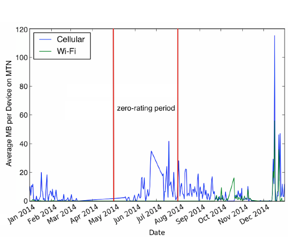

# Control by Pricing, Not Blocking {.center}

The economic-mechanics companion to net neutrality: how **money** shapes
**access to information**.

::: {.notes}
This deck is the economics half of the legal/economic chapter. The net-neutrality
deck covered the policy fight; here we focus on the mechanisms — fast lanes,
sponsored data, zero rating — and on the central claim from the book: pricing is a
*soft* form of information control. See censorship-book Ch. 4, §4.3–4.4.
:::

## Pricing as a Tax on Information

The course thesis: information control is **any tax on access to information**.

- A **block** forbids the content outright — the crudest tax
- **Paid prioritization** and **zero rating** are subtler: they leave content
  *reachable* but make some of it **cheaper, faster, or easier** than the rest
- Roberts's frame: this is **friction** — not a wall, a **toll** most users
  won't pay to go around

::: {.notes}
Anchor everything in the "tax on access" framing from Ch. 1. The book is explicit:
if we view economics/pricing as a way of introducing Roberts's "friction," then
paid prioritization restricts who receives what information *based solely on their
ability or willingness to pay.* No one is blocked — the price does the steering.
:::

## Two Mechanisms, One Effect {.smaller}

::: {.columns}
::: {.column width="50%"}
**Paid prioritization**

- A content source **pays the ISP** for faster/better delivery — a "fast lane"
- Or the ISP **throttles** what hasn't paid — a "slow lane" by another name
- Discrimination happens **inside the network**
:::
::: {.column width="50%"}
**Zero rating**

- Traffic to certain sites is **not metered** against the user's data cap
- The user pays **nothing** for "blessed" services, normal rates for everything else
- Discrimination happens **on the bill**
:::
:::

Both pick **winners among applications** — exactly what net neutrality forbids.

::: {.notes}
Keep the distinction crisp: prioritization changes *speed*, zero rating changes
*price*. Both produce the same downstream effect — they tilt the playing field
toward some content and away from the rest. The book frames net neutrality as
fundamentally "whether ISPs can discriminate among content sources" via blocking,
throttling, or paid prioritization.
:::

## A Quick Detour: The Internet's Business Model {.smaller}

The Internet is **tens of thousands of independent networks (ASes)** that interconnect.
Two ways money flows:

- **Customer–provider**: one AS *pays* another for reachability
- **Settlement-free peering**: bartering — two ASes swap traffic, no money, mutual benefit

Paid prioritization and **peering disputes** both live here — and they are easy to confuse.

::: {.notes}
You need this to read the Netflix/Comcast story correctly. Net-neutrality rules
govern the *access* ISP's treatment of traffic; peering disputes are economic
negotiations *between* networks. Same plumbing, different question. See
Fig. "Internet business model" in the book.
:::

## Was Comcast "Blocking" Netflix? {.smaller}

2014: streaming-video congestion spikes; popular story said ISPs were **blocking** content.

- The real story: a **classic peering dispute**, more economics than censorship
- **Netflix**: "I already paid transit (Cogent) to carry my bits to your eyeballs"
- **Comcast**: "You can congest any link you choose — balance your own traffic"
- Resolved **in the market**: Netflix paid Comcast to add interconnect capacity

::: {.notes}
The teaching point: not every slowdown is censorship. M-Lab tests *looked* like
ISP throttling but the congestion was actually in a transit network (Cogent), and
the end-to-end test crossed multiple ASes. Distinguishing blocking/throttling/paid
prioritization from an economic peering dispute is the analytical skill here.
:::

## The Rules: Net Neutrality's "Bright Lines"

The 2015 FCC **Open Internet Order** reclassified ISPs as **Title II** common carriers:

- **No blocking** lawful traffic
- **No throttling** lawful traffic
- **No paid prioritization** — no selling fast lanes

With a carve-out for **"reasonable network management"** (security, congestion).

::: {.notes}
Note what the rule does *not* do: it never banned all prioritization — an ISP can
always prioritize all video over all bulk transfer. The line is about
*application-specific* discrimination: FaceTime over Skype, Netflix over a rival.
Repealed 2017, reinstated 2024 — a political pendulum.
:::

## The Regulatory Pendulum {.smaller}

Net neutrality regulation **comes and goes** with the political climate:

| Year | What happened |
|---|---|
| **2015** | Open Internet Order — Title II, bright-line rules |
| **2017** | Repealed (Restoring Internet Freedom Order) |
| **2024** | Reinstated by the FCC |
| **2025** | **Struck down in court** (next slide) |

::: {.notes}
The underlying *principle* — the network shouldn't pick winners among applications —
outlives the formal rules. Even with no rules in force, US ISP behavior has been
mostly fine, because incentives now align (next slides). Use the table to show how
unstable the formal regime is.
:::

## A 2025 Vignette: US Net Neutrality Falls in Court {.smaller}

::: {.vignette}
On **January 2, 2025**, the **U.S. Court of Appeals for the Sixth Circuit** struck
down the FCC's 2024 net-neutrality order, holding the FCC lacks authority to
classify broadband as a Title II "telecommunications service." It was the first
major telecom ruling after the Supreme Court's 2024 **Loper Bright** decision
ended *Chevron* deference — so the court read the statute itself instead of
deferring to the agency. **As of mid-2026, there are no federal net-neutrality
rules in force.**
:::

::: {.notes}
Freshest US hook — verify/swap each year (see coverage-notes). Public-interest
groups declined to seek Supreme Court review, so this is settled for now. The
mechanism matters as much as the outcome: post-Loper Bright, agency rules built on
"ambiguous" statutes are far more fragile. Source: Sixth Circuit, In re: MCP No.
185 (Jan 2, 2025).
:::

## Why the Sky Didn't Fall {.smaller}

Even with the rules gone, US ISPs mostly **don't** block or throttle. Why?

- ISPs now have a **huge incentive to cooperate** with Netflix, Amazon, Google —
  their customers *demand* reliable access to those services
- Much ISP infrastructure itself **runs on those clouds**
- An ISP whose customers can't reach the big platforms **has no business**

The 2014-style **peering disputes are largely dead** — incentives realigned.

::: {.notes}
This is the book's nuance: don't oversell the doom. Market forces, not regulation,
keep US ISPs honest *for now*. But that's exactly why the threat has moved — read
the next slide.
:::

## The Threat Moved Up the Stack

The book's key reframing: the most acute threats to open access are **no longer the ISPs**.

- They've shifted to **consolidated platforms** — cloud hosts, CDNs, app stores,
  search engines, social media, streaming
- A **small number of companies** can now block access to **vast amounts** of content
- Net neutrality watched the **pipes**; the **chokepoints are now the platforms** (Ch. 3)

::: {.notes}
Tie back to the platform chapter. Net neutrality put a microscope on ISPs while
leaving the rest of the ecosystem — where discrimination was already happening —
untouched. The lesson for 2026: fight the last war (ISP fast lanes) and you miss
the platform consolidation that's the real lever now.
:::

# Zero Rating {.center}

Information control by **price** — the clearest case of a *toll* on attention.

::: {.notes}
Pivot to §4.4. Zero rating is the cleanest illustration of "control by pricing":
nothing is blocked, but some content is free and the rest costs money — and in
markets with high data costs, that difference is decisive.
:::

## What Is Zero Rating?

An ISP charges by **data used** — but **doesn't meter** traffic to certain services.

- For "blessed" sites, the user pays **nothing**; for everything else, normal rates
- Common in **developing regions** with **expensive cellular data**, often in
  **video streaming**
- US example: **T-Mobile's Binge On** (streaming video exempt from the data cap)

::: {.notes}
The mechanism is purely economic — no DPI required to "block" anything. The book's
one-liner: zero rating "does not forbid users from reaching content, but it makes
some content meaningfully cheaper to use and therefore more likely to be used."
:::

## Facebook's "Free Basics"

Download an app; get **free access** to a **subset** of apps and sites (news,
health, jobs) — **no carrier data charges**.

- Everything **outside** the app incurs **normal fees**
- Offered across many developing regions
- The obvious worry: it **skews** what users read and use toward the **blessed set**

::: {.notes}
This is the canonical case. The design itself nudges consumption toward a curated
slice of the Internet and away from everything else — a pricing-shaped filter on
what information people encounter. India famously *banned* it in 2016 on net-
neutrality grounds.
:::

## Walled Garden, or Gateway Drug? {.smaller}

The central empirical question — does zero rating **trap** users or **onboard** them?

::: {.columns}
::: {.column width="50%"}
**Walled garden**

Users stay inside the free set; the rest of the Internet stays out of reach.
A pricing-shaped **filter bubble**.
:::
::: {.column width="50%"}
**Gateway drug**

The free app is a first taste; users **graduate** to the full, paid Internet.
:::
:::

Which one wins depends on the **counterfactual** — and that's empirical.

::: {.notes}
The book is careful here: whether zero rating is anti-competitive or pro-access
"depends on the counterfactual." Where data is otherwise unaffordable, a walled
garden may beat *nothing*; where it isn't, it locks users into a few dominant
platforms. We tried to measure which story holds.
:::

## A Natural Experiment: Cell C Zero-Rates WhatsApp

When the South African carrier **Cell C** zero-rated WhatsApp, **cellular WhatsApp
usage roughly tripled (3×)**.

- The effect appeared on **Wi-Fi too** — users treated the app as "free to use anywhere"
- Small sample (~19 users), so read as **suggestive**, not definitive

::: {.notes}
This is a real natural experiment from our longitudinal MySpeedTest study (Kenya/
South Africa). The 3× cellular jump is the headline number in the book. Flag the
small-N caveat honestly — it's a teaching moment about measurement.
:::

## A Natural Experiment: MTN Zero-Rates Twitter (2014 World Cup)

{width="70%"}

Usage was **higher during and after** the promotion — the effect **persisted**.

::: {.notes}
MTN zero-rated Twitter May–July 2014 (red lines mark the window). Cellular usage
picked up with a slight lag, peaked near the end, and stayed elevated for months —
evidence the shift isn't pure short-term substitution. By year-end it returned to
baseline, so the *durable* effect is partial. The persistence-after-promotion point
is the one the book highlights.
:::

## What Users Told Us {.smaller}

Surveys in **Kenya and South Africa** (zero-rating penetration was still slow):

::: {.columns}
::: {.column width="50%"}
**Why use it**

- Free access to specific sites
- High cost of paid plans
- Just wanting to try the service
:::
::: {.column width="50%"}
**Why not rely on it**

- Narrow range of apps
- Limited *versions* of apps
- Promotions end
- Walled-garden app hard to navigate
:::
:::

Most users **preferred the full, paid versions** — but free promotions still raised usage.

::: {.notes}
The survey cuts against a strong walled-garden story: users who started via zero
rating often moved to paid full-service plans. But "free" still measurably bends
behavior. Both things are true — that tension is the point.
:::

## A 2025 Vignette: Europe Bars Zero Rating {.smaller}

::: {.vignette}
On **July 10, 2025**, the **Court of Justice of the EU** (Case **C-367/24**, a
Romanian "unlimited internet bonus") again ruled that **zero-rating violates the
EU Net Neutrality Regulation (2015/2120)** — discriminating among content on
**commercial**, not technical, grounds. Combined with **BEREC** guidelines, the
practice is effectively **off the table across the EU** — even as the US has *no*
net-neutrality rules at all.
:::

The **same mechanism**, two **opposite** legal answers — pricing-based control is a
**policy choice**, not a technical inevitability.

::: {.notes}
The transatlantic split is the teaching gold: the EU treats zero rating as
prohibited discrimination; the US (post-2025) has no federal rule and zero rating
is generally permitted. Verify/swap the EU case each year. Source: CJEU C-367/24
(July 10, 2025); BEREC net-neutrality guidelines.
:::

## Takeaways {.smaller}

- **Pricing is information control.** Zero rating and paid prioritization steer
  attention by **ability/willingness to pay** — Roberts's **friction**, not a wall.
- **Zero rating durably shifts usage** toward blessed services — even **after** a
  promotion ends.
- **Walled garden vs. gateway** depends on the **counterfactual**; in high-cost
  markets the answer is genuinely mixed.
- **The rules are unstable and divergent** — struck down in the US (2025), barred in
  the EU (2025).
- **The real chokepoints moved up the stack** to consolidated platforms.

::: {.notes}
Land the through-line: control doesn't need a firewall. A price difference most
people won't pay to escape is enough to shape what a population reads and uses.
:::

# Next: Measuring Information Control {.center}

How do we tell **censorship** from a **bad day on the network**?

*See censorship-book Ch. 4 (Legal and Economic Controls), §4.3–4.4 (Paid
Prioritization, Zero Rating); next, Ch. 5 (Measurement).*

::: {.notes}
Bridge to measurement: the Comcast/Netflix story showed how hard it is to tell
throttling from congestion from a peering dispute. That's exactly why we need the
measurement toolkit (OONI, M-Lab, Censored Planet) coming up in Ch. 5.
:::
