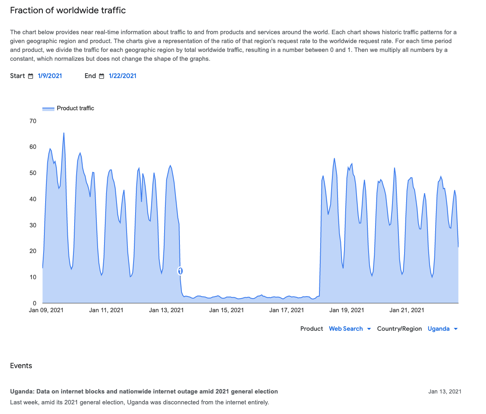
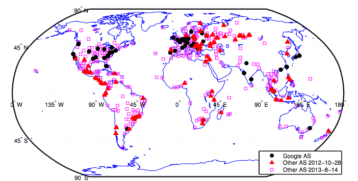
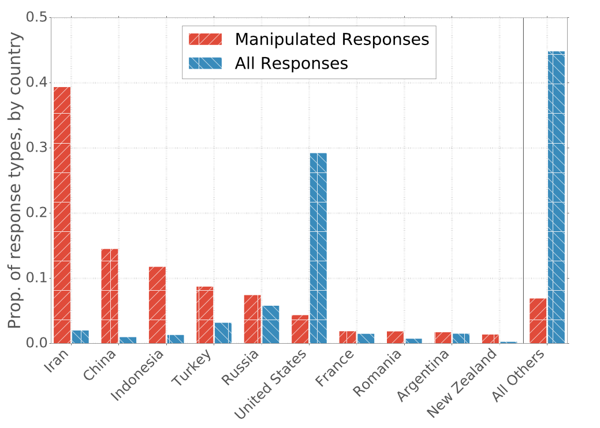
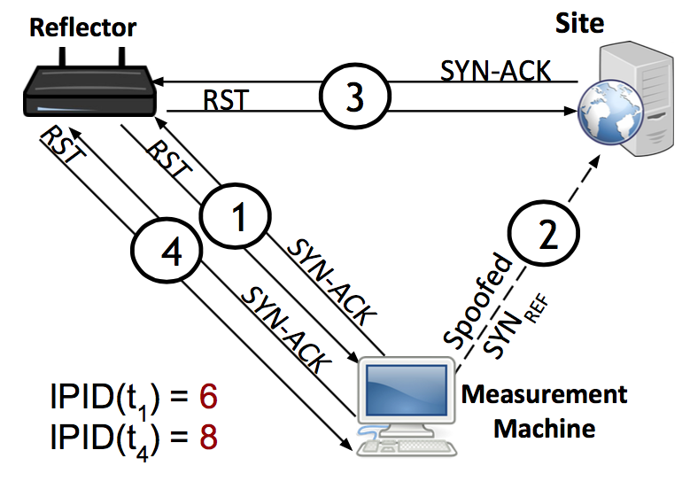

## How Do We Know? {.center}

Information control is often **designed to look like an ordinary network failure**.

This lecture is about **measurement** — turning anecdotes into evidence, and
telling **censorship from breakage**.

::: {.notes}
Open with the core epistemic problem of the whole chapter. A page won't load. Is
that a censor, a misconfigured resolver, an expired cert, or a bad upstream link?
The entire field of censorship measurement exists to answer that question rigorously.
This is Ch. 5 of the book — the "how we know" chapter that sits between the
mechanisms (Ch. 2-4) and circumvention (Ch. 6).
:::

## Why Measure Information Control?

- **Mitigation** — to circumvent control, first understand *where, when, how* (Ch. 6)
- **Variation** — is it uniform across a country? across regimes? does it spike on
  **sensitive dates** (Tiananmen anniversary) or around **elections and protests**?
- **Explanation** — tie a regime's *type* to its *methods*; complements or substitutes?
- **Diffusion** — China as the "thought leader" in repression; techniques spread

::: {.notes}
Book §5.1. Frame measurement as serving both engineers (circumvention) and social
scientists (political science theories about how regimes behave). The political-science
questions are real research questions: do authoritarian regimes that allow elections
censor differently? Does a state ever have an incentive to *decrease* censorship?
Large-scale measurement is how we test theories built from small case studies.
:::

## A Tax We Have to Detect

Recall the course thesis: information control is a **tax on access to information** —
often **friction**, not an outright wall.

That makes it **hard to measure**:

- **Hidden** — deniable; "just a network problem"
- **Intermittent** — switched on for an election, off afterward
- **Hyper-localized** — one ISP, one region, one app

::: {.notes}
Connect back to Roberts's friction/flooding framing from the intro deck. Friction is
*designed* to be ambiguous — that ambiguity is a feature for the censor and a problem
for the measurer. Everything in this chapter is a response to hidden, intermittent,
hyper-localized control.
:::

## OONI: The Workhorse {.smaller}

The **Open Observatory of Network Interference** — volunteers run **OONI Probe**, which
runs a suite of tests and uploads results to open data.

::: {.columns}
::: {.column width="50%"}
- **Web connectivity** — is a site reachable?
- **Instant messaging** — WhatsApp, Signal, Telegram
:::
::: {.column width="50%"}
- **Circumvention** — Tor, Psiphon, VPNs
- **Performance** — speed, video quality
:::
:::

Millions of measurements from **200+ countries since 2012**; explore them at
**OONI Explorer** without running anything.

::: {.notes}
Book §5.1. OONI is the leading open-source tool and the one we'll use hands-on. Key
design point: it's open data — anyone can audit and replot. The Measurement Aggregation
Toolkit (MAT) at explorer.ooni.org/chart/mat lets you visualize confirmed blocks vs.
anomalies vs. failures over time. Compare with the next slide: a black-box bellwether.
:::

## Google Transparency Report: A Bellwether

Google's **Traffic** report tracks fluctuations in traffic to Google services — a
**black-box signal** that something is disrupting reachability.

- Specific to **Google services**, but a useful **bellwether** for broader disruption
- Best when it **corroborates** an independent measurement

::: {.notes}
Book §5.1. Contrast with OONI: Google sees its own traffic dip but can't tell you
exactly *what* a censor did. It's a coarse, deniable-from-the-outside signal. The power
comes from triangulation — when Google's traffic dip lines up with OONI's confirmed
blocks, you have two independent witnesses. That's the next slide.
:::

## Case Study: Uganda 2021

OONI showed **per-ISP social-media blocks** over the same window. Two independent
methods, **same event** — that corroboration is the gold standard.

::: {.vignette}
History rhymes: after Uganda's **January 2026 general election**, OONI again documented
**blocking of WhatsApp and Facebook** on Ugandan networks — the same election-time
playbook, five years later. *(OONI, 2026.)*
:::

::: {.notes}
Book §5.1 walks through the 2021 Uganda shutdown. The teaching point is corroboration:
Google's traffic graph (this image) shows the macro dip; OONI shows which ISPs blocked
which apps. The 2026 repeat is the live hook — same country, same playbook, freshly
documented. Swap the vignette each year for the freshest election-time block OONI
documents. Source: OONI 2026 "Measuring Internet Censorship" report.
:::

## A Recipe: Investigating a Suspected Block {.smaller}

The book's five-step walkthrough — "is **example-news.org** blocked in Country X?"

1. **Falsifiable hypothesis** — name the ISP, protocol, expected failure mode
2. **Find vantage points** — OONI Probe? VPS in-country? side channel? a local volunteer?
3. **Run the right tests** — DNS → TCP → TLS handshake → HTTP fetch, vs. a control
4. **Distinguish blocking from breakage** — repeat across ISPs, over time, with controls
5. **Be conservative** — claim what the data shows, not "Country X censors the web"

::: {.notes}
Book §5.1 "A Walkthrough." This is the spine of the whole chapter and the most
important slide for students doing projects. Emphasize Step 4: the most common student
mistake is treating *any* failure as censorship. Three checks: multiple ISPs (country
policy is consistent; a local outage isn't), repeat over time (transients decay), and a
control set of unrelated sites (if *everything* is broken, you're measuring a network
failure). Step 5 is about scientific humility — bound your claim to the networks and
window you observed.
:::

# Measuring Technical Controls {.center}

DNS · TCP/IP · Web — *(censorship-book §5.2)*

## Measuring DNS Manipulation: The Hard Part

**Strawman:** look up a domain from many resolvers; flag answers that disagree with the
"right answer."

**Problem:** there is **no single right answer**. Three causes of inconsistency:

- **Censorship** (intentional manipulation)
- **Misconfiguration** (benign)
- **Load balancing / CDNs** (legitimate, by design)

::: {.notes}
Book §5.2. This is the central difficulty of DNS measurement. Popular services
deliberately return different IPs to different users for performance. So "responses
disagree" is the *normal* case, not evidence of censorship. Set up the next slide: the
Google map shows just how much legitimate variation exists.
:::

## No Single Right Answer

Google returns a nearby **front-end** IP to each user. Hundreds of valid answers — and
this map is nearly a decade old; replication is far broader now.

::: {.notes}
Book §5.2, Figure (google-frontend). Every dot is a *legitimate* answer for google.com.
This is why "the IP differs" can't mean "censorship." Drive home: the measurement
challenge is separating this legitimate spread from manipulation.
:::

## Consistency + Verifiable Checks {.smaller}

Since no single check is decisive, look for **multiple checks failing together**.

::: {.columns}
::: {.column width="50%"}
**Consistency metrics**

- IP address
- **Autonomous System** (same ISP?)
- HTTP content returned
- Reverse DNS (IP → name)
:::
::: {.column width="50%"}
**Independently verifiable**

- **TLS certificate**: right domain?
- Signed by a **trusted CA**?
- Currently **valid** (not expired)?
- Re-test fetching cert with **SNI**
:::
:::

A valid, browser-trusted certificate for the right domain needs **no cross-comparison** —
it verifies on its own.

::: {.notes}
Book §5.2. Two flavors of check. Consistency = compare across vantage points (weak
individually, strong when several fail at once — e.g., different IP *and* different AS
*and* a self-signed cert). Independently verifiable = the TLS cert stands alone: there's
no good reason a real service hands out a different cert per vantage point. Example from
the book: reverse lookup of a google.com IP yields ...1e100.net, Google's hosting domain —
a clue, not proof.
:::

## DNS Manipulation: Prevalence

- **Iran, China, Indonesia, Turkey, Russia** stand out
- Manipulation is **not uniform within a country** — some resolvers manipulate ~none,
  others ~80% of tested domains
- Targets: **gambling, pornography, P2P, social media, video**

**Encrypted DNS** (DoH / DoT) raises the cost of this manipulation — so censors now
measurably **block the encrypted resolvers** too *(see Ch. 2 / the Circumvention deck)*.

::: {.notes}
Book §5.2, Figure (iris-results). Note the *within-country* variation — it's not a
national monolith; individual resolvers differ wildly. That's either a measurement
artifact or a real manifestation of porous censorship. Honest answer from the study: we
don't fully know. Good moment to model scientific humility. Encrypted-DNS tie-in: DoH/DoT
hide the plaintext lookups that DNS injection targets, so they're a circumvention move —
which is why measurement studies now track *blocking of the encrypted resolvers
themselves*. Recent work (e.g., Li et al. 2024) found ~6% of encrypted DNS queries
censored globally but ~36% from inside China; DoT/DoH/DoQ are widely blocked in censored
regions. Cross-link to Ch. 2 (encrypted DNS mechanics) and Ch. 6 (circumvention) — don't
re-teach the protocol here.
:::

## Measuring TCP/IP: The Vantage-Point Problem

To test whether **Origin → Target** is blocked, you usually need a machine **inside** the
censoring country. You rarely have one.

**Idle scan / "spooky scan"** turns an ordinary in-country host (a **reflector**) into an
unwitting vantage point — using a **side channel**.

::: {.notes}
Book §5.2 "Measuring TCP/IP Manipulation." This is the cleverest technique in the
chapter and worth slowing down for. The vantage-point problem is fundamental: you can't
get probes everywhere, especially not in the countries you most want to measure. Side
channels are the workaround — and they're also the source of the ethics debate later.
:::

## The IP ID Side Channel {.smaller}

Many hosts stamp every outgoing packet with a **global, incrementing IP ID** counter.
Watch the counter remotely and you can infer **how many packets the host sent**.

::: {.notes}
Book §5.2, Figure (spooky scan). Walk the four steps on the image:
(1) probe reflector → learn IP ID = 6;
(2) send a SYN to the Site *spoofed* to look like it came from the reflector;
(3) Site replies SYN-ACK to the reflector, which sends a RST (incrementing its IP ID);
(4) probe reflector again → IP ID = 8, so a packet got through → no block.
Two conditions: the IP ID must be (a) sequential and (b) global, not per-connection.
:::

## Reading the Counter: Forward vs. Reverse

- **No blocking** — full handshake; reflector sends RST; **IP ID jumps**
- **Forward blocked** — SYN never reaches Target; no SYN-ACK; **IP ID flat**
- **Reverse blocked** — SYN-ACK can't get back to reflector; **IP ID flat**

Detection is **statistical** — hypothesis testing over many trials against background
noise. Validated against **known blocklists** (Citizen Lab) and known-blocked Tor bridges.

::: {.notes}
Book §5.2. The signal is noisy — background traffic also bumps the IP ID — so you run
many randomized trials and use a likelihood-ratio test. Validation matters: the method
was checked against ground truth (Citizen Lab block lists, Tor bridges known to be
blocked in China). Ethics preview: the book restricts reflectors to *infrastructure*
machines to avoid implicating individuals — that's the bridge to the ethics section.
:::

## Measuring Web Filtering: Encore {.smaller}

**Encore** makes the user's **browser** the vantage point. A site running Encore serves
JavaScript that asks the browser to load an object from a **third-party** target.

- Blocked by the **same-origin policy** from *reading* cross-origin data...
- ...but **resource embedding** (``, `<style>`, `<iframe>`) is looser
- `onload` / `onerror` leak the **one bit** Encore needs: did it load?

Many images, same domain failing → **domain blocked**; same IP failing → **IP blocked**.

::: {.notes}
Book §5.2 "Measuring Web Filtering." Encore exploits the same mechanism that powers
Facebook Like buttons and analytics — the web is *built* on cross-origin requests.
Encore doesn't need to read the response (the same-origin policy forbids that); it only
needs success/failure, which onload/onerror provide. By varying what it loads (same
domain vs. same IP vs. same URL) it infers the *granularity* of blocking. This is the
most ethically contested tool in the chapter — flag it now.
:::

## Measurement Meets Real Infrastructure {.smaller}

These techniques now map **state censorship systems** at scale:

- **China's Great Firewall** — measured as a **multi-layered** system (DNS, TCP/IP,
  HTTP/S, SNI), continuously profiled by tools like **GFWeb**
- **Iran** — filtering at **multiple layers** of the stack, blocking **millions** of
  domains
- **Kazakhstan** — the state pushed its **own root CA** onto users to run a
  nationwide **HTTPS man-in-the-middle**, until browsers **blocklisted** the cert *(2019; again Dec 2020)*

::: {.notes}
Book §5.2 (web-filtering subsection) names all three. The teaching point: the remote
side-channel methods scale up to characterize entire national systems. GFW is not one
box but layered filtering at DNS/TCP/HTTP/SNI. Iran (Tai et al., 2025) operates at
multiple layers and blocks millions of domains. Kazakhstan is the vivid one: in July 2019
the state told citizens to install the "Qaznet" root certificate and then MITM'd HTTPS
to ~37 domains (Google, Facebook, Mail.ru); Chrome, Firefox, and Safari blocklisted the
cert, and again when Kazakhstan retried in December 2020 (Raman et al., IMC 2020;
Mozilla, 2020). Kazakhstan is the cleanest real-world example of a *rogue root CA* —
cross-link to the Technical chapter's HTTPS/TLS material.
:::

## Other Measurement Platforms {.smaller}

- **Censored Planet** — remote, continuous, side-channel measurement at global scale
- **ICLab** — VPS-based probes across many countries
- **OONI** — volunteer probes + open data

Censored Planet packages the methods we just saw as named techniques:
**Satellite/Iris** (DNS), **Augur** (TCP/IP, the IP-ID side channel), **Hyperquack** (HTTP/S).

Each trades off **representativeness**, **coverage**, and **risk to people** differently.
**There is no single best vantage point.**

::: {.notes}
Book §5.1 takeaways. VPS-based (ICLab) is safe and easy but not representative of
residential users — a datacenter in a country isn't a home connection in a rural area.
Volunteer probes (OONI) are representative but raise recruitment and safety issues.
Side-channel (Censored Planet) needs no in-country consent but lives in an ethical gray
zone. The choice is a values trade-off, not a purely technical one. The named techniques
map onto exactly the methods earlier in this deck: Satellite/Iris compare open vs. trusted
resolvers (the DNS-consistency idea); Augur is the IP-ID idle/spooky scan for TCP/IP;
Hyperquack injects keywords into HTTP/S to known-behavior servers. Censored Planet has run
since Aug 2018 and collected tens of billions of measurements from ~95,000 vantage points
weekly (censoredplanet.org). One slide, three techniques, all already taught.
:::

# Measuring Platform & Legal Controls {.center}

Beyond the network: who took it down, and why? *(censorship-book §5.3–5.4)*

## Transparency Reports: Promise and Problems {.smaller}

Platforms publish **transparency reports** on takedown requests and removals. Useful — but
**self-reported and self-audited**.

::: {.columns}
::: {.column width="50%"}
**They tell you**

- How many requests / removals
- Often by **country** and **request type**
:::
::: {.column width="50%"}
**They usually hide**

- **Who** requested it
- **Automated vs. manual**
- Appeals & reinstatement
- Consistent **categories**
:::
:::

X's last full report was **2017**; transparency is only as durable as a platform's will.

::: {.notes}
Book §5.3. The format is the message: each platform chooses what to disclose, so
cross-platform comparison is nearly impossible. Concrete examples to cite: Google's
right-to-be-forgotten reporting (~2M delisting requests, ~50% granted, all manual);
Spotify showing Russia at 22,000+ requests vs. single digits elsewhere; Reddit refusing
a Pakistani takedown and accepting the risk of being blocked. The big gap: they rarely
say *who* asked or whether a *bot* decided.
:::

## Legal & Economic Controls Need Other Tools {.smaller}

The restriction's **source** differs: platform moderation vs. **external** legal/economic
pressure.

- **Lumen Database** — millions of takedown notices (DMCA, court orders); reveals
  systematic **DMCA abuse** (4B+ links, false claims to bury criticism)
- **Natural experiments** — **FOSTA/SESTA** (2018), **GDPR** geo-blocking, **NetzDG**:
  compare platform behavior before/after a law
- **Economic controls** — **zero-rating**, **demonetization**, payment cutoffs, app-store
  removals — visible mostly via **self-reports**

::: {.notes}
Book §5.4. Key distinction: platform controls = platform's own decision; legal/economic
controls = external pressure on the platform. Different sources need different methods.
Lumen makes legal demands machine-readable. Laws create natural experiments — when
FOSTA/SESTA passed, Craigslist killed personals overnight; that's a measurable shock.
Economic controls (demonetization, payment cutoffs) are the hardest — platforms don't
publish them, so we rely on creator self-reports and news.
:::

## The DSA: Mandatory, Structured Transparency {.smaller}

The EU **Digital Services Act** requires **VLOPs** (45M+ EU users) to file a
**Statement of Reasons** for *every* moderation action — in **machine-readable** form.

Each SoR records: decision type · content category · **automated or human** · legal
ground · **government order?** · appeals info.

::: {.vignette}
The **DSA Transparency Database** has logged **over 9 billion** moderation decisions in
**H1 2025 alone** — but **~99%** were platforms acting on their **own terms**, not legal
orders, showing how little of online control is formal law. *(European Commission, 2025.)*
:::

::: {.notes}
Book §5.3–5.4. The DSA fixes the four big gaps in voluntary reports: it's *mandatory*,
*specified*, *standardized*, and *centralized*. It even separates "orders from
authorities" from platform-initiated removals — exactly the attribution problem we
couldn't solve before. The 9-billion figure is the live hook (verify annually; the
Commission updates it). Caveats for the cold-call: it covers only VLOPs, only EU users,
and visibility ≠ accountability. The "Brussels effect" hasn't extended it globally yet.
:::

# The Ethics of Censorship Measurement {.center}

*(censorship-book §5.5)*

## Three Ways to Measure — Three Risk Profiles

- **Deploy researchers** (Citizen Lab) — consented, but snapshots only; risk to *researchers*
- **Deploy software to citizens** — better coverage, but risk to *volunteers*
- **Co-opt deployed software** (spooky scan, Encore, open resolvers) — scale and
  continuity, but **implicates people without consent**

The first two are ethically cleaner — and often **can't get the coverage** we need.

::: {.notes}
Book §5.5 overview. The cruel trade-off of the whole field: the methods that respect
consent (researchers, volunteers) can't deliver the continuous, fine-grained, baseline-
before-and-after coverage you need to study an election. The method that *can* (co-opting
devices) is the one that puts uninvolved people's machines on record reaching censored
sites. The rest of the section lives in that tension.
:::

## Censorship Measurement Falls in a Gap

- **IRBs** review *human-subjects* research — measuring a censor's behavior often **isn't**
  that, so it falls **outside** their purview...
- ...yet it can still put **people at real risk** in repressive jurisdictions
- **Legal ≠ safe**: a method legal on paper can still endanger a user; an *illegal*
  measurement may create no real hazard

::: {.notes}
Book §5.5. This is the structural problem: the oversight machinery (IRBs) was built for a
different kind of research and isn't equipped to evaluate this. So researchers are
largely self-governing. Stress the legal/safe gap — in some regimes legality is no
protection, and risk is genuinely hard to estimate in advance.
:::

## The Paradox of Consent {.smaller}

The usual safeguard — **informed consent** — can **backfire** here.

- Consent at the scale/continuity needed is often **impossible**
- Worse: consenting creates **documentary evidence of intent** to test censorship
- An **unwitting** cross-origin request carries **plausible deniability** — "that's just
  how the web works"

The more common co-opted measurement is, the **safer** any one user becomes.

::: {.notes}
Book §5.5 "Paradox of Consent." This is the most counterintuitive and best discussion
point. The deontologist says: always get consent. The consequentialist says: consent here
may *increase* harm by documenting intent, while the noise of normal third-party traffic
protects the unwitting. Princeton's IRB on spooky scan: you can't hold a user responsible
for traffic their device sends — they might have malware; their browser already hits
hundreds of third-party domains. The web's architecture is *itself* consequentialist.
:::

## Toward Ethical Norms {.smaller}

No bright-line rules — but four guiding principles:

- **Proportionality** — risk should match benefit (a Facebook-widget probe ≠ an
  illegal-site probe in a repressive state)
- **Transparency** — tag measurements, informative PTR records, publish methods
- **Harm minimization** — choose URLs, vantage points, and data handling carefully
- **Community dialogue** — norms evolve with the technology and the politics

Salganik's *Bit by Bit* offers compatible scaffolding: **respect for persons**,
**beneficence**, **justice**, **respect for law & public interest** *(Belmont + Menlo)*.

::: {.notes}
Book §5.5 "Moving Forward." Land here: responsible measurement is governed by judgment,
not a checklist. Restricting to *infrastructure* machines (ISP resolvers, CDN nodes) is
the most common harm-mitigation move — they arguably aren't individual human subjects.
Matthew Salganik's *Bit by Bit: Social Research in the Digital Age* (2018) names four
principles for exactly this kind of consent-hard digital research: respect for persons
(autonomy/consent), beneficence (balance risk and benefit), justice (fair distribution of
risk and benefit), and respect for law and public interest. The first three come from the
1979 Belmont Report; the fourth is the 2011 Menlo Report's extension for ICT research.
They map cleanly onto the book's four: beneficence ↔ proportionality/harm-min, respect for
persons ↔ the consent debate, respect for law & public interest ↔ transparency/dialogue.
Use Salganik as the named framework students can cite. End with humility: researchers
should be modest about risks they can't foresee.
:::

## Key Takeaways {.smaller}

- Measurement is hard because control is **hidden, intermittent, hyper-localized**
- **No single right answer** (DNS) and **no single best vantage point** (probes/VPS/side
  channels) — credible studies **distinguish blocking from breakage** and **report
  conservatively**
- These methods now map **whole national systems** — China's layered GFW, Iran,
  Kazakhstan's rogue-CA HTTPS interception
- **Triangulate**: OONI + Google + transparency data corroborate each other
- **Platform/legal/economic** controls need different tools — **DSA** is a step toward
  mandatory, structured transparency
- The **ethics** are genuinely contested: consent can paradoxically **increase** risk

::: {.notes}
Recap mapping to the chapter's three takeaway boxes (§5.1, §5.2, §5.5). The throughline:
honest, bounded claims; multiple independent witnesses; and ethical humility.
:::

# Next: Taking Back Control {.center}

We can *measure* the tax. Next we study how users **route around it** —
VPNs, Tor, and circumvention.

*(see censorship-book Ch. 5 Measuring Information Controls — whole chapter; next, Ch. 6)*

::: {.notes}
Bridge to circumvention (Ch. 6). Measurement and circumvention are two sides of the same
coin: you measure to know what to circumvent, and circumvention tools (Tor, VPNs, Psiphon)
are themselves things OONI measures the blocking of. Point students at OONI Explorer and
the DSA Transparency Database for project data.
:::
