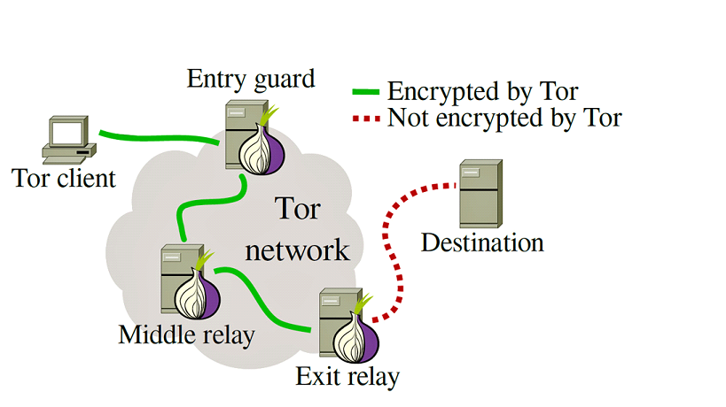
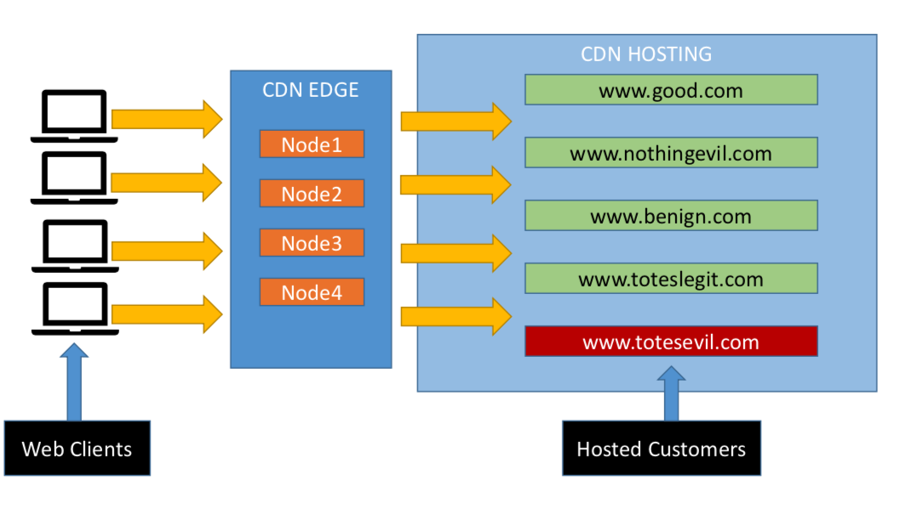
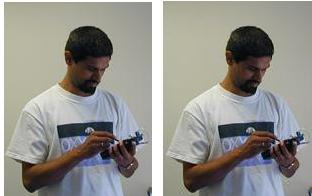
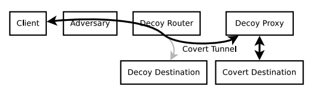

## The Cat and the Mouse {.center}

Every circumvention tool is one move in an **adversarial game**: users route around
control, censors detect and block the route, users obfuscate, censors adapt.

There is no permanent win — only a **shifting balance of cost**.

::: {.notes}
Frame the whole chapter as a cat-and-mouse game, the book's recurring metaphor. The
question is never "is this tool unbreakable?" but "does it raise the censor's cost faster
than the censor raises the user's cost?" Tie back to the course thesis: control is a *tax*
on access; circumvention is about lowering that tax for the people who need it. See
censorship-book Ch. 6 intro.
:::

## Two Cross-Cutting Themes

::: {.columns}
::: {.column width="50%"}
**Legality and risk vary**

- Running a VPN/Tor is legal speech in the US and most of Europe
- China criminalized unauthorized VPNs in **2017**; the UAE, Russia, Iran restrict tools
- The real question is rarely "is it legal?" but **"what will an adversary do if they notice?"**
:::
::: {.column width="50%"}
**Accessibility beats raw capability**

- A tool only helps if people can **install, configure, and trust** it
- Under a slow mobile link, a censored app store, and real personal risk
- **One-click** clients (Psiphon, commercial VPNs) often beat manually picking a Tor bridge
:::
:::

::: {.notes}
These two themes run through every section. The strongest tool on paper is useless if a
non-technical user under pressure can't bootstrap it. And the choice of tool is ultimately
a *threat-model* decision, not a technical one — a diaspora journalist and a domestic
activist using the same tool run very different risks. Book Ch. 6 intro.
:::

# Virtual Private Networks {.center}

*The most widely used circumvention tool — and the most misunderstood.*

## Why a Proxy at All?

The Internet is a **public network**: IP headers reveal source and destination even when
the payload is encrypted. A **passive observer can see who is talking to whom.**

A **proxy** outside the censor's firewall breaks that line of sight — you talk to the
proxy, the proxy talks to the blocked site.

::: {.notes}
Establish the core idea before naming VPNs. Encryption hides the *payload*, not the
*routing headers* — and traffic analysis can even infer content from encrypted flows. A
proxy sitting outside the firewall is the fundamental move; a VPN is just one packaging of
it. Book §6.1.
:::

## What a VPN Actually Does

{width="80%"}

**Encrypt and tunnel** your traffic to a server on the uncensored Internet; that server
fetches blocked content and relays it back.

::: {.notes}
The concept is simple. Three implicit assumptions, all of which can fail: (1) the VPN
server itself is reachable, (2) the provider is trustworthy, (3) the encrypted tunnel
can't be broken or analyzed. Enterprises use the same mechanism so employees can "be on"
the campus/corporate network from home — that's where most students first meet a VPN.
:::

## VPNs Are Not a Panacea {.smaller}

::: {.columns}
::: {.column width="50%"}
**Not always secure**

- Independent audits keep finding critical bugs in consumer VPN clients and extensions
- These can leak your **identity and traffic** — the opposite of the promise
:::
::: {.column width="50%"}
**Not always private**

- Facebook's **Onavo** marketed itself as a privacy VPN — while Facebook eavesdropped the traffic
- Rule of thumb: if the VPN is **free**, *you* may be the product
:::
:::

VPNs can also be **blocked** outright or made **illegal**.

::: {.notes}
"You get what you pay for." Free providers often monetize traffic rather than charging.
Onavo is the canonical cautionary tale — pulled from app stores, rebranded "Facebook
Research," then shut down. The protective value of a VPN depends on *who runs it* as much
as on the crypto. Book §6.1.
:::

## How People Actually Use VPNs

Survey of **729 US VPN users** (Dutkowska-Żuk et al., 2022):

- **Students** lean on VPNs to **access content** and bypass network restrictions, used *occasionally*
- **General population** uses them *continually* for **privacy and security**
- Most users have a **pragmatic, fuzzy mental model**: they know what a VPN is *for*, not what it *does*
- Both groups felt **safest with institutional** (not commercial) VPNs

::: {.notes}
Our own research (Feamster is a co-author). The headline: users choose on cost, security,
and speed; they widely *believe* free VPNs collect their data, yet use them anyway. The
gap between perceived and actual protection is the teaching point — and it generalizes to
other privacy tools. Book §6.1, dutkowska2022understanding.
:::

## Censorship Can *Increase* Access

When a platform is blocked, **VPN demand spikes** — and often stays high after the block lifts.

- Nigeria's **2021 Twitter ban**: VPN searches surged; many kept using them post-2022
- India's 2020 TikTok ban; Pakistan's **2024–25** restrictions on X (HTTPS-layer blocking)
- Once users learn a tool, many **keep it as insurance** against the next block

::: {.notes}
Roberts's paradox: censorship can *raise* information access by teaching people to
circumvent. A censorship event can permanently shift behavior. Pakistan is instructive —
strict HTTPS-layer interference, yet VPN adoption stayed elevated for months. Book §6.1.
:::

## The Cat-and-Mouse Game, Concretely

::: {.vignette}
**Russia, as of February 2026.** Roskomnadzor has confirmed blocking **469 VPN
services** and aims to block **92% of all VPNs by 2030**, backed by ~**20 billion
rubles/year** for permanent blocking infrastructure. In Jan–Apr 2025 alone it restricted
**12,600 items "promoting VPNs"** — twice all of 2024. Yet about **41% of Russian users**
still rely on a VPN. *(Sources: Roskomnadzor figures via iz.ru, Jan 22 2026; TechRadar,
2025.)*
:::

Censors block protocols (OpenVPN, WireGuard) and provider IP ranges; providers answer with
**obfuscation and rotating infrastructure**. Nobody wins permanently.

::: {.notes}
This is the freshest, best-sourced hook — swap it each year (see coverage-notes). The
lesson: "does my VPN work?" has no stable answer; it's a continuously evolving outcome of
an adversarial process. Users in China, Iran, Russia, Turkmenistan often run a *portfolio*
of 3–4 tools. Book §6.1 "Blocking the VPNs themselves."
:::

# Anonymous Communication: Tor {.center}

*From hiding **what** you say to hiding **who** is saying it.*

## Chaum's Mix: The Building Block

A **mix** (Chaum, 1981) takes in many messages, **re-encrypts and delays** them, then
forwards — so an observer can't link an incoming message to an outgoing one.

- Adversary may know **all senders and all receivers**...
- ...but **cannot link** a sent message to a received one
- Chain mixes into a **mixnet**: even one honest mix preserves anonymity

::: {.notes}
The mix is the conceptual ancestor of onion routing. Its anonymity comes from *batching +
delay*, which is exactly why a basic mix is fine for email but terrible for the web.
Inserting random delays and padding foils correlation. Book §6.2.
:::

## Tor: Low-Latency Onion Routing

{width="78%"}

Build a **circuit** with pairwise **symmetric** keys (cheap), then peel one encryption
layer per relay. No single relay sees **both** endpoints.

::: {.notes}
The design move that makes Tor usable: avoid expensive public-key ops at every hop by
setting up symmetric keys during circuit construction. Second-generation onion routing,
running ~20 years, ~2.5M users. Note the red dashed hop — exit-to-destination is *not*
Tor-encrypted, which is where exit-node and DNS-leak risks live. Book §6.2.
:::

## Tor's Threat Model and Its Limits {.smaller}

::: {.columns}
::: {.column width="50%"}
**The guarantee**

- Safe **unless** an adversary sees **both** entry and exit
- Clients start every circuit with a chosen **guard**; circuits rotate
:::
::: {.column width="50%"}
**The cracks (protocol intact, user exposed)**

- **Traffic correlation** by a global/near-global observer
- **Website fingerprinting** from packet sizes & timing
- **DNS leaks**, **rogue exit nodes**, browser fingerprinting, login mistakes
:::
:::

"Tor isn't broken" is true of the **crypto** — not of the **user**.

::: {.notes}
Key nuance the book stresses: the protocol can be sound while users are still
deanonymized. >40% of exit-relay traffic once went to Google's 8.8.8.8 — a correlation
gift. Sybil attacks (flooding the network with malicious relays) and link-level
adversaries (controlling ASes/IXPs) round out the threat model. Book §6.2 "Tracking and
Deanonymization."
:::

## Onion Services and the "Dark Web"

- **.onion** services are reachable *only* through Tor — you can't stumble onto them
- **Not all illegal**: BBC, NYT, ProPublica run onion mirrors so sources/readers in
  censored countries get in safely
- But also marketplaces: **Silk Road** (Ross Ulbricht, convicted 2015)

::: {.vignette}
**January 21, 2025:** President Trump granted Ross Ulbricht a **full and unconditional
pardon** after ~11 years in prison, reigniting debate over anonymity tools and the harms
they can enable. *(Sources: NPR, CNBC, Jan 21 2025.)*
:::

::: {.notes}
Use the dark web to make the dual-use point concrete: the same anonymity that protects a
whistleblower protects a drug market. The Ulbricht pardon is a fresh, dated hook for the
policy debate — should truly anonymous tools exist given the abuse? Tor's position:
anonymity is a right worth protecting despite abuse. Book §6.2 "The Dark Web."
:::

## Beyond Tor: Pick a Portfolio {.smaller}

| System | Primary goal | Anonymity | Blocking resistance | Ease of use |
|---|---|---|---|---|
| **Tor** | Anonymous browsing | Strong | Moderate (improving w/ PTs) | Moderate |
| **I2P** | Internal hidden services | Strong (internal) | Strong (internal) | Lower |
| **Psiphon** | Access during shutdowns | Weak | Strong | High |
| **Lantern** | Access during shutdowns | Weak | Moderate | High |
| **Commercial VPN** | Privacy + access | Weak | Variable | High |

No single "best" tool — match the tool to the **threat model**.

::: {.notes}
The practical takeaway of the whole chapter. A journalist might use Tor+obfs4 for source
contact, a VPN for routine work, and Psiphon as a shutdown fallback. Psiphon bundles many
transports and auto-selects; it absorbed huge surges during Myanmar's 2021 coup and Iran's
2022–23 protests. I2P uses *garlic routing* and is best for internal services. Book §6.2
"Other Anonymous Communication Systems."
:::

# Information Hiding {.center}

*When even the **existence** of circumvention traffic is incriminating.*

## Pluggable Transports: Disguise the Traffic

**Problem:** Deep Packet Inspection (DPI) lets a censor fingerprint and block Tor itself.

**Solution:** make Tor traffic look like *something else*.

- **Randomize** it: **obfs4**, ScrambleSuit (look like nothing)
- **Mimic** another protocol: **meek**, **WebTunnel** (look like ordinary HTTPS)
- The transports can themselves be **blocked** — so Tor ships *several*

::: {.notes}
Two families: scramble into apparent randomness, or imitate a real protocol. WebTunnel
(late 2024) blends into TLS and became vital in Russia — then most bridges were blocked by
mid-2025, forcing Tor to distribute bridge addresses over Telegram. This is the
cat-and-mouse game inside the cat-and-mouse game. Book §6.2 "Pluggable Transports."
:::

## Domain Fronting

{width="68%"}

A request names an **allowed** domain in the visible **SNI/IP**, but the **encrypted Host
header** names the blocked one — both on the **same CDN**.

::: {.notes}
The destination appears in three places: IP, TLS SNI (both visible), and the HTTP Host
header (encrypted). Domain fronting exploits the mismatch. Used by Tor's meek, Psiphon,
Signal, Telegram. Catch: Google and Amazon *disabled* it (checking SNI vs. Host),
"for security" — collapsing a powerful technique. Book §6.2.
:::

## Steganography: Hide the Channel Itself

{width="46%"}

Goal: hide the **existence** of communication, not just its contents. Desired properties:
**client/server deniability**, **robustness**, and usable **performance**.

::: {.notes}
Motivation: if a censor can merely *detect* you're running circumvention software, that
alone can incriminate you or justify a block — contents don't matter. Image
steganography (here, via outguess) embeds data in low-order bits. Deniability can be
deterministic or statistical; sometimes you need the censor to not even *suspect*. Book §6.3.
:::

## Covert Channels: Infranet and Collage {.smaller}

::: {.columns}
::: {.column width="50%"}
**Infranet (2001)**

- Hide requests in a **sequence of web requests**; hide responses in **images**
- Needs **dedicated** forwarders/responders — a deployment burden
:::
::: {.column width="50%"}
**Collage**

- Use **user-generated content** (Flickr, YouTube) as drop sites
- Erasure-code + steganography; **task mapping** tells Alice where to look
- **No dedicated infrastructure**; traffic looks like ordinary browsing
:::
:::

::: {.notes}
Infranet → Collage is the arc: from needing your own infrastructure to piggybacking on UGC
hosts that already serve billions of images. Collage's design goals — robust, deniable,
infrastructure-free — are the template. Task mapping hashes a message ID to "tasks" like
"search blue flowers on Flickr." Book §6.3, Burnett2010:collage.
:::

## Why Information Hiding Stays Niche

**"The Parrot Is Dead."** Faithfully *imitating* a real protocol is **harder than
implementing it** — every quirk, bug, and corner case is a fingerprint.

- Covert channels are also **low-bandwidth**
- Today's real role: **bootstrapping** — sneak a bridge address or key past the censor,
  then switch to a faster tool
- Simpler **obfs4-on-a-real-protocol** beats elaborate mimicry in practice

::: {.notes}
The Houmansadr "Parrot is Dead" result is the key lesson: a moving target is brutally hard
to imitate. So info hiding's practical niche is narrow but real — get one small secret
past the wall to set up a high-bandwidth channel. High-bandwidth covert channels remain an
open research problem. Book §6.3.
:::

# Infrastructure Solutions {.center}

*Push circumvention **into the network** — leave no endpoint to block.*

## Decoy Routing

{width="62%"}

A **cooperating router on the path** spots a hidden **sentinel**, then deflects your
traffic to a **covert proxy** — while the censor sees only the innocuous **decoy
destination**.

::: {.notes}
The clever inversion: there's no proxy *endpoint* for the censor to enumerate and block —
the relay is the network itself. Walk the flow: client connects normally → sends sentinel
→ decoy router resets the decoy connection and proxies to the covert destination. Curveball
(2011) put the sentinel in an HTTP field; Telex/Cirripede used the TLS handshake/TCP SYN.
Book §6.4.
:::

## Decoy Routing: Promise vs. Deployment

::: {.columns}
::: {.column width="50%"}
**Why it's appealing**

- Only a **passive tap** needed, no inline blocking
- Censor **can't enumerate** the relays without breaking unrelated traffic
- Newer systems handle **asymmetric** routing & active attacks
:::
::: {.column width="50%"}
**Why it's barely deployed**

- Requires **ISP cooperation** / special on-path equipment
- The ISP's *own* customers get no benefit — bad incentives
- Mostly waiting on a **deployment story**, not more research
:::
:::

::: {.notes}
Decoy routing is technically the most elegant idea in the chapter and the least deployed.
The blocker is incentives, not cryptography: an ISP gains nothing by helping users abroad.
As software routers speed up, an on-path middlebox deployment may become feasible. Book §6.4.
:::

## The Whole Chapter in One Picture {.smaller}

| Layer | Hides... | Example | Main weakness |
|---|---|---|---|
| **VPN / proxy** | the destination | commercial/institutional VPN | server reachable & trusted? |
| **Tor** | who is talking | onion routing + guards | correlation, fingerprinting |
| **Pluggable transports** | that it's circumvention | obfs4, meek, WebTunnel | transports get blocked too |
| **Info hiding** | the channel's existence | Infranet, Collage | low bandwidth; "parrot" problem |
| **Decoy routing** | the proxy endpoint | Curveball, Telex | needs ISP cooperation |

Every layer **raises the censor's cost** — none is a final answer.

::: {.notes}
Synthesis slide. Read it as a progression *up the stack of what you're hiding*: payload →
identity → the fact of circumvention → the channel itself → the endpoint. The unifying
thesis: circumvention lowers the *tax* on access for those who need it most, while the
censor keeps raising it. Effective practice = a portfolio matched to a threat model.
:::

# Taking Back Control {.center}

Circumvention is a **continuous, adversarial process** — assemble a **portfolio**, match
it to your **threat model**, and remember that **accessibility** matters as much as
cryptographic strength.

*Read along: censorship-book Ch. 6 — Taking Back Control (whole chapter).*

::: {.notes}
Close on the chapter's two cross-cutting themes: legality/risk vary by jurisdiction, and
the most usable tool usually beats the most capable one. Point students to the full Ch. 6.
Next up in the course: the Conclusion / Internet governance (Ch. 7).
:::
